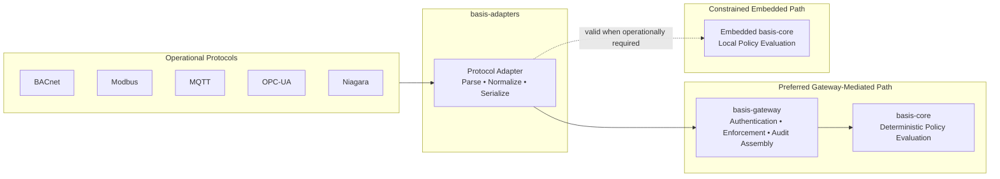

# basis-adapters Architecture

## Purpose

`basis-adapters` exists because operational protocols do not speak authorization semantics. Field-level protocols — BACnet, Modbus, MQTT, OPC-UA, Niagara, and others — express intent in protocol-native terms: register writes, property updates, method invocations, topic publications. The authorization kernel speaks none of these languages, and must not.

`basis-adapters` is the normalization layer that bridges operational protocols and the BASIS authorization system. Adapters parse protocol-native messages, translate them into the subject-resource-action vocabulary that `basis-core` evaluates, submit the resulting authorization request, and serialize the returned decision back into the appropriate protocol-level response.

The adapter layer enables `basis-core` to remain protocol-agnostic. It enables `basis-gateway` to remain protocol-agnostic. The protocol disappears at the authorization boundary — what remains is a normalized request against a normalized resource with a normalized action.

---

## Definition of an Adapter

An adapter is a protocol-specific translation component that converts external operational semantics into BASIS authorization semantics.

Adapters exist because operational protocols express intent differently. A BACnet `WriteProperty` on an analog value object, a Modbus Function Code 06 register write, and an MQTT publish to a control topic all represent the intent to modify a controlled parameter — but they represent it in entirely different structural, encoding, and semantic terms. An adapter understands those protocol-native terms. The kernel does not.

Adapters are the only components in the BASIS ecosystem that are permitted to contain protocol-specific logic. That is also what constrains them: protocol logic belongs in the adapter, not elsewhere.

---

## Adapter Responsibilities

### Protocol Parsing

Adapters receive and decode protocol-native messages. This includes frame parsing, PDU decoding, and extraction of the operational parameters embedded in protocol-specific structures.

Examples:
- BACnet `WriteProperty`: decode the object identifier, property identifier, property value, and optional array index
- Modbus Function Code 06: extract the register address and write value
- MQTT publish: extract the topic, payload, and QoS level
- OPC-UA method invocation: extract the node ID, method ID, and input arguments

Protocol parsing belongs entirely within the adapter. The kernel receives none of this structure.

### Protocol Normalization

Adapters translate decoded protocol operations into the normalized authorization primitives that `basis-core` evaluates. The primary output of normalization is a `DecisionRequest` containing a verified subject, a resource identifier, and a requested action drawn from the BASIS action vocabulary.

Normalization requires adapter-level judgment: the adapter must understand what a specific protocol operation means in operational terms and map it to the appropriate authorization semantics. That judgment is the adapter's responsibility and cannot be delegated to the kernel.

### Protocol Serialization

Adapters convert the authorization decision returned by `basis-core` into the appropriate protocol-native response. Denials are not generic — they must be expressed in the terms the protocol and device expect.

Examples:
- BACnet: `BACnet-Error-PDU` with appropriate error class and error code
- Modbus: exception response frame with the appropriate exception code
- MQTT: connection refusal, publish rejection, or subscription denial at the protocol level
- OPC-UA: `StatusCode` indicating authorization failure

The adapter is responsible for preserving the protocol semantics of the denial. It must not translate a `DENY` decision into a successful protocol response.

### Protocol Discovery (Optional)

Where protocols provide discovery mechanisms, adapters may implement device discovery, object discovery, or resource enumeration. This remains protocol-specific behavior. Discovery results may inform how resources are identified in `DecisionRequest` objects, but discovery is not required for the core normalization path.

---

## Adapter Non-Responsibilities

### Authorization Evaluation

Authorization evaluation belongs exclusively to `basis-core`. Adapters submit `DecisionRequest` objects and apply `DecisionResponse` outcomes. They do not evaluate policy and must not contain policy evaluation logic.

### Authorization Logic

Adapters must not contain logic that determines whether a request should be permitted. Policy logic belongs in the kernel. The following pattern is explicitly prohibited in adapter code:

```python
if user.role == "admin":
    allow()
```

Authorization decisions must originate from the kernel, not from adapter-level conditions, role checks, or operational heuristics.

### User Authentication

Authentication belongs to identity providers, gateways, and authentication services. Adapters may consume identity context — a verified subject identity passed through from the gateway or provided by the adapter host — but they must not become authentication systems. An adapter that issues credentials, validates tokens, or manages session state has exceeded its scope.

### Overriding Kernel Decisions

Kernel decisions are authoritative. Adapters must not reinterpret `ALLOW` decisions, reinterpret `DENY` decisions, or construct protocol-specific exceptions that override the kernel's authorization outcomes.

A `DENY` from `basis-core` is a deny at the protocol layer. The adapter's role is to express that denial correctly in protocol terms, not to reconsider it.

---

## Protocol Normalization

Normalization is the process of converting protocol-specific operations into protocol-independent authorization semantics. The goal is to isolate protocol complexity from authorization logic.

The kernel evaluates normalized authorization semantics rather than protocol-specific semantics. The kernel should not understand BACnet, Modbus, MQTT, OPC-UA, or Niagara. The protocol should disappear at the authorization boundary.

### BACnet Example

Protocol-native input:

```text
BACnet WriteProperty
Device: AHU-1
Object: AV-4
Property: presentValue
Value: 72
```

Normalized `DecisionRequest`:

```json
{
  "subject": "operator-123",
  "action": "write",
  "resource": "ahu-1/av-4/present-value",
  "context": {
    "protocol": "bacnet",
    "operation": "WriteProperty"
  }
}
```

The kernel receives a subject, an action, and a resource identifier. It does not receive a BACnet object type, property identifier, or array index.

### Modbus Example

Protocol-native input:

```text
Modbus Function Code 06
Register: 40012
Value: 72
```

Normalized `DecisionRequest`:

```json
{
  "subject": "operator-123",
  "action": "write",
  "resource": "register/40012",
  "context": {
    "protocol": "modbus",
    "function_code": "06"
  }
}
```

The kernel evaluates the write request against a resource identifier. The Modbus function code, register address encoding, and data representation remain inside the adapter.

### Normalization Principle

The normalization contract is strict: whatever protocol context the adapter retains in the `context` field of the `DecisionRequest` is supplementary information for audit enrichment, not authorization input. Policy rules are evaluated against subject, action, and resource. Protocol context must not become a mechanism for adapters to inject protocol-specific authorization logic.

---

## Adapter Integration Models

`basis-adapters` supports two integration models. Both are architecturally valid. The choice between them depends on deployment topology, operational constraints, and the availability of a trusted gateway boundary.

### Gateway-Mediated Model (Preferred)

```text
Protocol
→ Adapter
→ basis-gateway
→ basis-core
```

In this model, the adapter normalizes the protocol request and submits a `DecisionRequest` to `basis-gateway` over a network or inter-process boundary. The gateway authenticates the adapter, performs identity normalization for the subject embedded in the request, invokes `basis-core`, enforces the decision, and emits the gateway-layer audit record. The adapter receives the decision result and serializes the protocol-native response.

This is the preferred deployment architecture whenever a trusted gateway boundary is operationally feasible. The gateway-mediated model provides:

- Centralized authentication: credentials and subject identity are verified at the gateway, not distributed across individual adapters
- Centralized runtime enforcement: the gateway is the defined enforcement boundary
- Centralized audit assembly: the gateway produces the canonical audit record from a single controlled point
- Consistent identity normalization: all adapters submit normalized requests through the same identity verification path
- Clearer trust boundaries: the gateway is the defined entry point for authorization requests

### Embedded Model (Valid When Operationally Required)

```text
Protocol
→ Adapter
→ basis-core
```

In this model, the adapter invokes `basis-core` directly in-process, without routing requests through `basis-gateway`. The adapter host becomes responsible for authentication, identity normalization, and audit assembly.

This model is explicitly supported for:

- Air-gapped deployments where network connectivity to a gateway is not available
- Embedded deployments with strict resource or latency constraints
- Environments where the operational cost of a gateway boundary is not justified by the deployment scale
- Edge installations where a standalone adapter-plus-kernel deployment is the appropriate unit of deployment

Embedded deployment does not alter authorization semantics, compatibility requirements, audit expectations, or public contract requirements. An adapter operating in embedded mode must still produce valid `DecisionRequest` objects, apply `DecisionResponse` outcomes faithfully, and emit audit evidence that conforms to the canonical audit schema.

Deployment topology must not change authorization behavior.

---

## Architecture Diagram



---

## Trusted Adapter Boundary

Adapters are trusted normalization components. They occupy a specific position in the trust model: they are trusted to parse protocol requests accurately, normalize protocol intent faithfully, preserve operational semantics, and serialize responses correctly. They are not trusted to authorize, grant permissions, define policy, or override decisions.

This distinction is consequential. An adapter receives protocol input that may originate from unauthenticated or partially authenticated sources — field devices, controllers, operator workstations. The adapter must not extend trust from the protocol layer to the authorization layer without the appropriate verification.

An adapter that accepts untrusted protocol input and invokes `basis-core` directly becomes an enforcement boundary and must protect that boundary accordingly. The kernel assumes its inputs have been verified; if the adapter is the first point of contact with untrusted traffic, the adapter host bears the responsibility that the gateway would otherwise carry.

Direct kernel embedding does not weaken kernel semantics, but it shifts enforcement responsibility onto the adapter host.

---

## Enforcement Ownership

| Component | Responsibility                    |
| --------- | --------------------------------- |
| Adapter   | Protocol-level enforcement        |
| Gateway   | Runtime/API enforcement           |
| Kernel    | Authorization decision production |

The kernel decides. Enforcement boundaries enforce.

The kernel produces `DecisionResponse` objects. It does not enforce them. Enforcement is the act of translating a decision into an operational effect — denying a protocol request, blocking a command, returning a protocol-level error. That act belongs at the enforcement boundary, whether that boundary is the gateway in the preferred model or the adapter host in the embedded model.

In gateway-mediated deployments, the gateway enforces the authorization boundary; the adapter enforces the resulting protocol behavior. These are distinct enforcement acts: the gateway controls whether the request is permitted; the adapter controls how the denial or permit is expressed in protocol terms.

---

## Audit Ownership

| Component | Audit Responsibility         |
| --------- | ---------------------------- |
| Adapter   | Protocol evidence enrichment |
| Gateway   | Canonical audit assembly     |
| Kernel    | Decision evidence generation |

Adapters enrich audit evidence but must not define independent audit semantics.

The kernel writes its own audit record capturing the evaluation event: the subject, resource, action, decision outcome, and policy context. The gateway writes a separate audit record capturing the caller-facing runtime context: authentication outcomes, transport details, and the decision returned to the caller. Both records are part of the complete audit trail. The adapter contributes protocol-specific context — protocol type, operation name, device identifiers — via the `context` field of the `DecisionRequest`, enriching the gateway's record without redefining the audit schema.

Audit remains a shared compatibility surface. Adapters must not emit audit records that diverge from the canonical `AuditEvent` schema defined in `basis-schemas`. Protocol evidence fields must be carried in the defined extension points, not in new top-level fields that bypass schema governance.

---

## Deployment Philosophy

The adapter architecture is deployment-agnostic. It does not assume Kubernetes, microservices, cloud-native runtimes, SaaS deployments, or hyperscaler services.

Valid deployment configurations include:

- Embedded adapter with co-located kernel, without a gateway
- Adapter submitting requests to a gateway, with the kernel embedded in the gateway
- Multiple adapters sharing a single gateway instance
- Air-gapped deployment with adapter and kernel on the same machine
- OT boundary deployment with adapters at the field layer and a gateway at the supervisory layer

The architecture describes responsibilities rather than runtime topology. An adapter implementation should be portable across these configurations without changes to its core normalization logic.

---

## Compatibility Expectations

Adapters are downstream consumers of the contracts defined in `basis-core` and `basis-schemas`. Their compatibility obligations follow from that position.

Adapters must:

- Construct `DecisionRequest` objects that conform to the schema defined in `basis-schemas`
- Interpret `DecisionResponse` outcomes according to the semantics defined in `basis-core`
- Emit audit evidence that conforms to the `AuditEvent` schema
- Include `schema_version` on all emitted audit events

Adapters must not:

- Add fields to `DecisionRequest` that the kernel's schema does not recognize
- Interpret `DecisionResponse` outcomes in ways that diverge from the kernel's defined semantics
- Emit `AuditEvent` records that diverge from the canonical schema
- Introduce evaluation logic that callers come to depend on as if it were kernel behavior

An adapter that depends on undocumented kernel behavior, internal implementation details, or schema fields outside the public contract is not a compliant adapter. Compatibility with the public contract is the requirement; compatibility with a specific kernel version's internal state is not.

---

## Design Invariants

The following invariants constrain all adapter implementations. They are not implementation preferences — they are architectural requirements. An adapter implementation that violates any of them is not a compliant adapter.

1. Adapters normalize; they do not evaluate authorization.
2. Adapters must preserve protocol intent. Normalization must not alter the meaning of the operation being requested.
3. Kernel decisions are authoritative. The adapter applies the decision; it does not adjudicate it.
4. Deny decisions must not be overridden. A `DENY` from the kernel is a denial at the protocol layer.
5. Protected operations must fail closed. When authorization cannot complete, the adapter must deny the operation.
6. Protocol logic must not enter `basis-core`. The adapter is the terminal point of protocol-specific code.
7. Adapter audit evidence must remain compatible with canonical audit semantics. Protocol context is enrichment, not schema divergence.
8. Embedded deployments must preserve public contracts. Deployment topology does not alter contract requirements.
9. Adapters must not create parallel policy languages. Protocol-specific permit logic is prohibited.
10. Deployment topology must not alter authorization semantics. A request that would be denied through the gateway must be denied in embedded mode.

---

## Relationship to `basis-core`

`basis-adapters` depends on `basis-core` for its contract definitions. Specifically:

- `DecisionRequest` and `DecisionResponse` types are defined in `basis-core` and `basis-schemas`; adapters import and use them
- The `AuditEvent` schema is defined in `basis-core` and `basis-schemas`; adapters produce audit evidence that conforms to it
- The adapter interface contracts — the interfaces that adapters must implement when producing `DecisionRequest` objects and applying `DecisionResponse` outcomes — are defined in `basis-core`'s `adapters` subpackage

`basis-core` does not depend on `basis-adapters`. The kernel has no knowledge of any specific protocol adapter implementation. Adapter implementations are not registered with, configured in, or referenced by the kernel.

The kernel's `adapters` subpackage defines the interfaces. `basis-adapters` implements them. The dependency flows in one direction.

---

## Relationship to `basis-gateway`

In the preferred gateway-mediated deployment model, `basis-adapters` and `basis-gateway` interact at the authorization request boundary. The adapter normalizes the protocol operation and submits a `DecisionRequest` to the gateway. The gateway handles authentication, identity normalization, kernel invocation, decision enforcement, and audit assembly.

The gateway is protocol-agnostic. It processes `DecisionRequest` objects; it does not process BACnet frames, Modbus PDUs, or MQTT messages. Protocol semantics remain inside the adapter. The gateway sees normalized authorization requests regardless of which protocol produced them.

`basis-gateway` may serve as the authorization backend for multiple concurrent adapter instances. The gateway does not couple to specific adapter implementations; the adapter does not couple to specific gateway configuration. The interface between them is the `DecisionRequest` / `DecisionResponse` contract.

Adapters emit `resource_type` and a *local* `resource_id` as separate fields; the gateway is the recommended boundary that composes these into the kernel's single typed `resource_id` (`ahu` + `rooftop-1` → `ahu:rooftop-1`), parallel to action composition. Adapters do not perform kernel-specific identifier composition. See [`docs/architecture/resource-identifier-reconciliation.md`](resource-identifier-reconciliation.md).

In the embedded model, the adapter invokes `basis-core` directly and the gateway is not present in the authorization path. In that case, the adapter host assumes the responsibilities the gateway would otherwise carry. This does not change the semantics of the authorization decision — it changes where enforcement responsibility resides.

---

## Future Adapter Examples

The following protocol families represent natural candidates for adapter implementations under the `basis-adapters` umbrella. None are defined here in implementation terms; this section establishes the scope of the adapter layer for architectural planning purposes.

**BACnet/IP and BACnet MS/TP** — the dominant protocol family in building automation, with a rich object model and well-defined service primitives. Adapters would normalize BACnet service requests (ReadProperty, WriteProperty, SubscribeCOV, ReinitializeDevice, and related services) into `DecisionRequest` objects.

**Modbus TCP and Modbus RTU** — widely deployed in industrial and building environments with a simple register-oriented model. Adapters would normalize Modbus function code operations (read coils, write registers, read/write multiple registers) against resource identifiers derived from register address mappings.

**MQTT** — the message-oriented protocol common in IoT and edge deployments. Adapters would normalize publish and subscribe operations against topic-derived resource identifiers, with subject identity sourced from connection credentials or embedded in the message context.

**OPC-UA** — the industrial interoperability protocol with a rich node model, method invocation, and subscription semantics. Adapters would normalize OPC-UA service calls against node identifiers translated into BASIS resource vocabulary.

**Niagara / NiagaraAX / Niagara4** — the Tridium application framework common in commercial BAS deployments. Adapters would normalize Niagara station operations against its component and point model.

**REST-based operational APIs** — vendor-specific HTTP APIs exposed by building controllers, gateways, or management platforms. Adapters would normalize HTTP method and path combinations against resource identifiers drawn from the API's resource model.

Each adapter family will require a separate architecture document when formal implementation work begins. The present document establishes the invariants, contracts, and integration models that those implementation documents must conform to.

---

## Summary

`basis-adapters` is the protocol normalization layer in the BASIS ecosystem. It exists to keep protocol logic out of the authorization kernel, to enable the kernel to evaluate authorization requests expressed in a consistent, protocol-independent vocabulary, and to carry authorization decisions back to the protocol layer in the appropriate form.

The adapter architecture rests on a clear separation: adapters normalize; the kernel evaluates; enforcement boundaries enforce; audit records evidence. No component substitutes for another's role. An adapter that evaluates authorization logic is not an adapter — it is an enforcement boundary without the kernel's guarantees. An adapter that overrides kernel decisions is not a compliant adapter — it is an authorization bypass.

Both the gateway-mediated and embedded integration models are explicitly supported. The gateway-mediated model is preferred when a trusted boundary is operationally feasible. The embedded model is valid when operational constraints require it. Deployment topology does not alter authorization semantics in either case.

---

## Related Documents

- [`docs/architecture/basis-ecosystem.md`](basis-ecosystem.md) — component responsibilities, dependency direction, and the role of `basis-adapters` in the BASIS Core Services Distribution
- [`docs/architecture/basis-gateway.md`](basis-gateway.md) — the gateway architecture, including the relationship between adapters and the gateway enforcement boundary
- [`docs/kernel-boundary-rules.md`](../kernel-boundary-rules.md) — the rules that protect `basis-core` as an isolated kernel, including the prohibition on protocol logic entering the kernel
- [`docs/architecture/compatibility-philosophy.md`](compatibility-philosophy.md) — compatibility commitments that govern the schema contracts adapters must satisfy
- [`docs/architecture/action-vocabulary.md`](action-vocabulary.md) — the action naming conventions that adapter normalization must produce
- [`docs/architecture/resource-identifier-reconciliation.md`](resource-identifier-reconciliation.md) — how the adapter's separate `resource_type` + local `resource_id` becomes the kernel's canonical typed `resource_id`
- [`docs/glossary.md`](../glossary.md) — definitions for Protocol Adapter, Protocol Normalization, Trusted Adapter Boundary, and related terms
