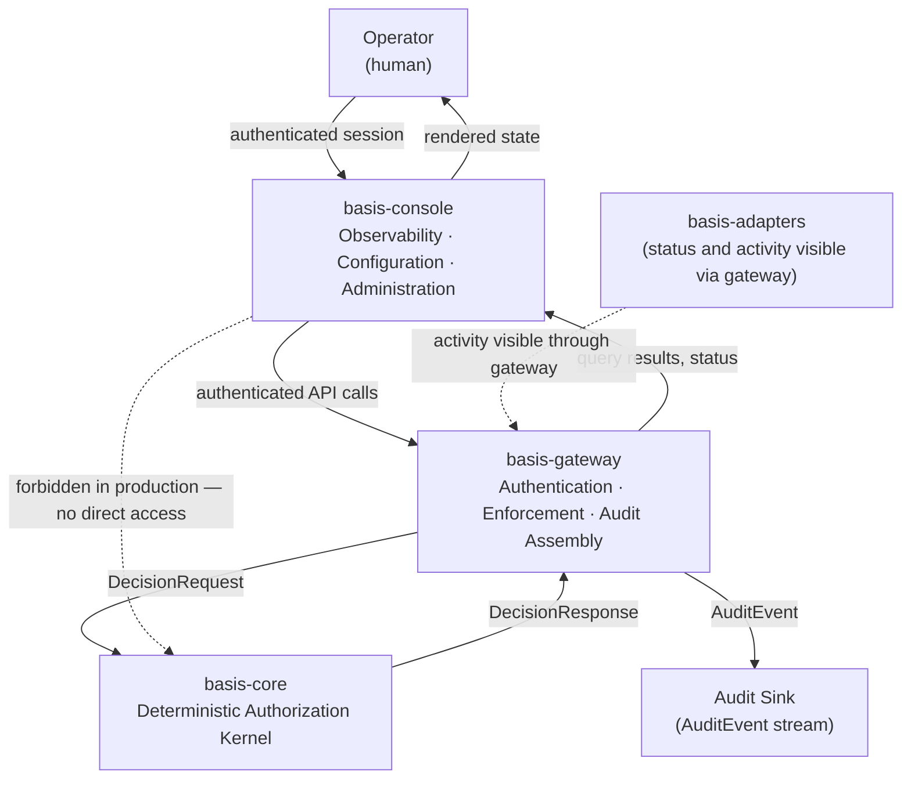

# basis-console Architecture

## Purpose

`basis-console` exists because authorization systems are difficult to operate without a human-facing interface. `basis-core` evaluates policy deterministically. `basis-gateway` enforces decisions at the API boundary. `basis-adapters` normalize field protocols. None of these components provide an interface for operators who need to understand what the system is doing, review policy state, examine audit records, or submit configuration changes.

`basis-console` is that interface. It gives operators visibility into policy state, authorization decisions, and audit activity. It provides interaction paths for submitting changes, reviewing system status, and understanding what the authorization system has done and why. It does this without becoming an authorization system itself.

The core architectural question `basis-console` answers is: what is the minimum set of responsibilities a console must own without becoming the authorization system itself? The answer is narrow. The console owns the interface. It does not own the logic behind it.

---

## Definition of basis-console

`basis-console` is a human-facing operational interface for observing, configuring, and interacting with BASIS components through established enforcement boundaries.

It is not an authorization engine. It does not evaluate policy, interpret access decisions, or determine who may do what. It is not an identity provider. It does not issue credentials, manage sessions, or federate identity. It is not a protocol adapter. It does not speak BACnet, Modbus, MQTT, or any other field protocol. It is not a deployment platform. It does not manage infrastructure, coordinate upgrades, or distribute configuration.

The console is an operator-facing interface layer. It renders information that the authorization system already has, and submits requests through channels the authorization system already enforces.

---

## Console Responsibilities

### Observability

The console provides operators with visibility into the authorization system's current and historical state. This includes:

- **Policy visibility** — displaying what policies are loaded, which rules they contain, and what resource and action scope they cover
- **Authorization decision visibility** — surfacing the outcomes of recent authorization evaluations: who requested what, against which resource, and what the system decided
- **Audit review** — presenting audit records in a form that operators can read, filter, and correlate across time, subjects, and resources
- **System status visibility** — displaying the operational state of BASIS components accessible through the gateway, including whether the gateway is reachable and whether the kernel has policies loaded

Observability is the console's primary responsibility. The console makes the authorization system understandable to the operators who are responsible for running it. Without a console or equivalent tooling, operators have no practical way to confirm what policies are active, whether audit records are being written, or why a particular request was denied.

### Configuration Workflows

The console supports workflows that allow operators to submit policy changes and configuration updates through established channels. This includes:

- **Policy submission** — providing an interface through which operators can prepare and submit policy changes to the system via gateway-authenticated API calls
- **Configuration review** — displaying current system configuration in a form that operators can inspect and reason about
- **Operator workflows** — supporting multi-step operational processes such as reviewing a proposed change, confirming intent, and submitting the request

The console facilitates these workflows. It does not become the source of truth. Policy state resides in deployment-specific policy management infrastructure and in the kernel's loaded evaluation state; the console is the window through which operators interact with that state — not the owner of it.

### Administrative Interaction

The console provides interaction paths for operators to initiate requests, submit changes, and review system state. This includes:

- **Submit changes** — sending policy or configuration updates to the gateway for processing
- **Review state** — querying and displaying current system state as returned by gateway APIs
- **Initiate requests** — triggering gateway-authenticated operations appropriate for the operator's role

The console is an interface layer for these interactions. The gateway validates, authenticates, and enforces them. The console does not bypass that enforcement.

### Operator Usability

The console exists partly to make authorization systems understandable to operators who are not authorization system engineers. A correctly deployed BASIS system may be opaque without tooling that surfaces its activity in a form humans can interpret. The console provides that surface.

This responsibility is real and architectural, not cosmetic. A console that is too narrow is useless; a console that overreaches becomes a parallel authorization system. The right scope is: everything an operator needs to understand and interact with the system through established interfaces, and nothing that belongs to those interfaces themselves.

---

## Console Non-Responsibilities

### Authorization Evaluation

The console must not evaluate authorization decisions. It must not contain logic that determines whether a subject is permitted to perform an action against a resource. It must not implement policy rules, role checks, or condition evaluation. Authorization evaluation belongs exclusively to `basis-core`.

If the console needs to determine whether to display something or permit a user interaction, it does so through a gateway API call — not through local authorization logic.

### Authentication

The console must not authenticate users independently. It does not issue credentials, validate tokens, or operate a session management system. Authentication belongs to `basis-gateway` and to the identity providers that the gateway is configured to trust.

The console may participate in authentication flows — redirecting to an identity provider, receiving and forwarding tokens — but it must not become an authentication system.

### Protocol Normalization

The console must not contain protocol translation logic. It must not parse or emit BACnet frames, Modbus PDUs, MQTT messages, OPC-UA service calls, or any other field-level protocol. Protocol normalization belongs to `basis-adapters`.

The console may display information about protocol adapter activity and status — surfacing what the adapters have done — but it must not do what adapters do.

### Identity Provider Administration

The console is not intended to replace identity provider management tooling. It is not a Keycloak admin console, an Auth0 dashboard, an Entra ID portal, or an Okta administration interface.

The console may display identity-related information — subject details drawn from audit records, role assignments visible in authorization decisions — but it must not become an identity provider management platform. Credential lifecycle management, realm configuration, user provisioning, and federation setup belong to the identity provider and to deployment-specific tooling for managing it.

### Device Management

The console must not become a device management platform. It is not a SCADA system, a building automation system, a BAS programming environment, or a device fleet manager. Operator-accessible device control, programming, and configuration belong in the operational technology systems appropriate for each protocol domain.

The console may display information about devices as they appear in audit records and authorization context, but it must not become the operational interface for managing those devices.

### Deployment Orchestration

The console must not own deployment infrastructure. Container management, upgrade coordination, configuration distribution, and installation validation belong to `basis-deploy` and to deployment-specific tooling. The console is a runtime interface, not a deployment system.

---

## Console Interaction Model

The console's interaction model follows a single path: operator actions flow through the console to the gateway, and the gateway enforces the appropriate boundary before reaching the kernel.

```text
Operator
  ↓
basis-console
  ↓
basis-gateway
  ↓
basis-core
```

This path is the architectural default. The gateway authenticates the console's requests, normalizes identity context, invokes the kernel when evaluation is required, and enforces the returned decision. The console receives the result and presents it to the operator.

The console must not communicate directly with `basis-core` except in explicitly bounded local development tooling scenarios. In development tooling, direct console-to-kernel communication may be necessary for testing policy evaluation in isolation — where a full gateway deployment is not available. This exception is narrow and must be explicitly documented in deployment context. It is not a pattern for production deployments.

The strongly preferred path in all production deployments is:

```text
console → gateway → kernel
```

and not:

```text
console → kernel
```

The gateway-mediated path preserves enforcement consistency, audit consistency, and trust-boundary consistency. A console that bypasses the gateway to reach the kernel directly also bypasses authentication, audit assembly, and enforcement — creating a path that the kernel was not designed to receive.

### Architecture Diagram



The dashed line is an architectural invariant in production deployments. The console does not reach the kernel directly.

---

## Relationship to basis-gateway

The gateway is the console's primary operational dependency.

The console does not have an independent path to authorization state, audit records, or kernel metadata. It obtains everything through the gateway's APIs. The gateway provides:

- **Authenticated APIs** — all console interactions are authenticated at the gateway boundary; the console presents operator credentials that the gateway verifies against the configured identity provider
- **Enforcement boundaries** — the gateway enforces authorization decisions on console requests just as it does on any other caller; operator access to policy state and administrative operations is subject to policy
- **Audit generation** — the gateway writes audit records of console-initiated operations; the console does not maintain its own audit trail
- **Runtime services** — policy queries, decision history, adapter status, and system health are surfaced through gateway-provided endpoints; the console is a consumer of these services, not their source

The gateway remains authoritative for runtime operations. When the console displays policy state, it is displaying what the gateway returned from the kernel. When the console reports an authorization decision outcome, it is presenting what the gateway recorded. The console adds the interface; the gateway provides the substance.

The console must be designed to degrade gracefully when the gateway is unreachable. An unavailable gateway means the console cannot surface live system state — but it must not respond by falling back to local authorization logic or cached decisions as a substitute for live gateway data.

---

## Relationship to basis-core

The console is not a kernel client.

In the production interaction model, the console has no direct dependency on `basis-core`. It does not import kernel libraries, invoke kernel evaluation, or inspect kernel internals. The kernel's public API surface is consumed by the gateway; the console consumes the gateway's API surface.

This indirection is intentional. It preserves:

- **Audit consistency** — kernel evaluation events are generated and recorded through the gateway's audit path; the console's access to those events follows the same path as any other caller
- **Enforcement consistency** — the gateway enforces authorization on console requests; there is no separate enforcement path for console-originated operations
- **Trust-boundary consistency** — the kernel assumes its callers have been authenticated and their inputs normalized; the gateway provides these guarantees; the console does not

The console may display kernel-derived information — policy metadata, decision outcomes, audit records — as surfaced through gateway APIs. It does not interact with the kernel to obtain that information directly.

---

## Relationship to basis-adapters

The console may observe adapter activity. It may display:

- Adapter connection status as reported through gateway administrative APIs
- Recent protocol activity as reflected in the audit record
- Adapter configuration in a read-only display context

The console must not own protocol translation, protocol execution, or protocol semantics. It must not submit BACnet commands, write Modbus registers, or publish MQTT messages. Those operations belong to `basis-adapters` and to the protocol systems those adapters serve.

Adapter observability through the console is appropriate. Adapter control through the console is not.

---

## Operator Workflows

The following workflows illustrate how operators interact with BASIS through the console. They are conceptual — the console's specific UI, interaction model, and endpoint structure are implementation decisions, not architectural requirements.

### Audit Review

An operator needs to understand why a particular subject was denied access to a resource.

```text
Operator
  ↓
basis-console (filters audit display by subject and resource)
  ↓
basis-gateway (authenticates the operator, queries audit records)
  ↓
Audit data (authorization decision records returned to console)
  ↓
basis-console (renders filtered audit view for the operator)
  ↓
Operator (reads the denial record, including reason and policy context)
```

The console requests audit data through the gateway. The gateway authenticates the request and returns the appropriate records. The console presents them. The audit record itself was written when the original decision was made — the console retrieves it, it does not produce it.

### Policy Review

An operator needs to confirm that a policy change is reflected in the active policy set.

```text
Operator
  ↓
basis-console (requests current policy state)
  ↓
basis-gateway (authenticates the operator, queries policy state through gateway APIs)
  ↓
Policy state (active rules, version, resource scope — sourced from gateway-accessible infrastructure)
  ↓
basis-gateway (returns result to console)
  ↓
basis-console (renders current policy state for the operator)
  ↓
Operator (confirms the expected policy is active)
```

The console displays the policy state the gateway returns. It does not hold a separate copy of policy state and must not serve as a policy source of truth. Where that state originates — from the kernel's loaded rules, from a deployment-specific policy store, or from a combination — is a deployment concern, not a console responsibility.

### Policy Submission

An operator needs to submit a policy update for loading.

```text
Operator
  ↓
basis-console (presents policy submission interface)
  ↓
basis-gateway (authenticates the operator, enforces authorization on the submission)
  ↓
Policy management path (deployment-specific infrastructure for policy intake and distribution;
  basis-core may validate kernel-owned semantics or contract compliance where appropriate)
  ↓
basis-gateway (returns success or error to console)
  ↓
basis-console (displays the result to the operator)
  ↓
Operator (confirms the submission outcome)
```

The gateway validates the operator's authorization to submit policy before routing the request. The console submits through the gateway; it does not write policy to deployment infrastructure directly, and it does not own the policy management path. How a submitted policy is stored, distributed, and made active is a deployment concern — the console's role ends at submission.

### Access Request Review

An operator needs to review recent access requests across a resource set.

```text
Operator
  ↓
basis-console (requests decision history for a resource scope)
  ↓
basis-gateway (authenticates the operator, queries decision records)
  ↓
Audit data (recent DecisionResponse records for the requested scope)
  ↓
basis-console (renders decision history for the operator)
  ↓
Operator (reviews allow and deny outcomes across the resource set)
```

---

## Audit Expectations

The console may display audit data, filter audit data, and correlate audit data across subjects, resources, time ranges, and decision outcomes. These are legitimate interface responsibilities.

The console must not redefine audit semantics, create alternative audit models, or become the audit authority.

Audit authority resides in `basis-core` and `basis-gateway`. The kernel writes the decision record. The gateway writes the caller-facing enforcement record. These records are the canonical audit trail. The console's role is to make them accessible to operators — not to produce them, supplement them, or reinterpret their meaning.

Specifically:

- The console must not emit `AuditEvent` records that supplement or replace kernel or gateway records
- The console must not define new audit event types that diverge from the `basis-schemas` audit schema
- The console must not present audit data in ways that alter its evidentiary meaning — for example, by marking a denial as an allow for display convenience, or by omitting records from a filtered view without communicating the omission
- Audit records presented by the console must accurately reflect the records that the authorization system produced

If the console aggregates or correlates audit records for operator convenience, it must do so additively — making records easier to find and understand, not altering what they say.

---

## Deployment Philosophy

`basis-console` is deployment-agnostic. The following assumptions are intentional:

- No mandatory dependency on Kubernetes, Helm, or cloud-native container orchestration
- No assumed hosting model — the console may be served as a standalone web application, embedded in a deployment package, or run as a local desktop tool
- No assumed UI framework — the choice of frontend technology is an implementation decision
- No cloud provider SDK dependencies in the console's core interaction model
- No assumption that the console is internet-accessible; OT deployments frequently operate in air-gapped or network-isolated environments

The console describes responsibilities, not runtime topology. A console implementation should satisfy its operational responsibilities — gateway-authenticated access, operator-facing observability, policy interaction workflows — regardless of how it is packaged and deployed.

In constrained deployments where a console is not feasible — resource-limited edge nodes, air-gapped single-device installations — BASIS must remain functional without it. See the Design Invariants section.

---

## Design Invariants

The following invariants constrain all console implementations. They are not implementation preferences. A `basis-console` implementation that violates any of them is not a compliant console.

1. **The console is an interface layer, not an authorization layer.** The console renders and submits; it does not evaluate.

2. **The console does not evaluate authorization decisions.** No policy logic, role check, or access condition may be evaluated within the console itself. All authorization evaluation belongs to `basis-core`.

3. **The console does not authenticate users independently.** The console participates in authentication flows but does not operate an authentication system. Authentication belongs to `basis-gateway` and to the identity providers it is configured to trust.

4. **The console does not bypass gateway boundaries.** All console interactions with the authorization system in production deployments flow through `basis-gateway`. Direct console-to-kernel communication is permitted only in explicitly bounded local development tooling, and must be documented as such.

5. **The console does not own protocol semantics.** Protocol normalization, protocol execution, and protocol-level enforcement belong to `basis-adapters`. The console may display adapter activity; it must not perform it.

6. **The console does not redefine audit semantics.** Audit records are produced by `basis-core` and `basis-gateway` according to the contracts in `basis-schemas`. The console displays those records. It does not produce, supplement, or alter them.

7. **Deployment topology must not alter authorization behavior.** Whether the console is deployed co-located with the gateway, on a separate host, or accessed remotely does not change what the authorization system evaluates or enforces. The console's deployment position must not create authorization path differences.

8. **The console exists to improve operational usability, not replace architectural boundaries.** When console scope expands into evaluation, authentication, or protocol handling, the console has overstepped its role. New operational needs should drive gateway API improvements, not console-level workarounds.

9. **The console must preserve auditability.** Console-initiated operations must be traceable through the authorization system's audit record. If a console action produces no audit record through the gateway, that is a gap in the audit trail, not a feature of the console's design.

10. **The console must remain optional within the ecosystem.** BASIS deployments must remain viable without `basis-console`. Enforcement correctness, audit completeness, and authorization semantics must not depend on whether a console is present. This prevents console-centric architecture: the system does not require a console to function correctly — it requires a kernel and a gateway.

---

## Future Possibilities

The following capabilities represent directions the console might develop. They are possibilities, not commitments. Each would require design work to specify the interaction model, the gateway API surface it depends on, and its relationship to existing components.

**Policy visualization** — graphical or structured representations of loaded policies, showing rule coverage, resource scope, and subject applicability in ways that are easier to inspect than raw rule text.

**Decision trace display** — operator-facing views of decision evaluation traces that show which rules matched a request, which did not, and why the outcome was what it was. This capability requires the gateway to expose decision trace information from the kernel; the console surfaces it.

**Audit exploration** — richer filtering, correlation, and navigation across audit records — searching by subject, resource, time range, or decision outcome; following a subject's activity across a time period; identifying unusual access patterns.

**Workflow orchestration** — structured, multi-step operator workflows for change management: drafting a policy change, routing it for review, recording approval, and submitting it through the gateway. This is a workflow interface, not a policy authority.

**Adapter status visibility** — richer display of adapter operational state: which protocol adapters are active, what devices they are connected to, and whether recent adapter activity shows anomalies.

Each of these possibilities remains bounded by the same invariants: the console does not evaluate, authenticate, normalize protocols, or redefine audit. Future capabilities are additions to the interface layer, not expansions of the console's architectural role.

---

## Summary

`basis-console` is the human-facing operational interface for the BASIS ecosystem. It provides observability into policy state, authorization decisions, and audit activity. It provides interaction paths for submitting changes and initiating administrative operations. It exists to make the authorization system understandable and operable by the humans responsible for running it.

The console occupies a specific, bounded position. It depends on `basis-gateway` for everything it surfaces, and it interacts with the authorization system exclusively through gateway-authenticated API calls. It does not evaluate authorization decisions, authenticate users, normalize protocols, or produce audit records. Those responsibilities belong to the components designed to carry them.

The console's scope is the interface layer. What happens behind the interface — evaluation, enforcement, audit — belongs to `basis-core`, `basis-gateway`, and `basis-adapters`. The console makes that work visible to operators without substituting for it.

---

## Related Documents

- [`docs/architecture/basis-ecosystem.md`](basis-ecosystem.md) — component responsibilities, dependency direction, and the role of `basis-console` in the BASIS Core Services Distribution
- [`docs/architecture/basis-gateway.md`](basis-gateway.md) — the gateway architecture; the gateway is `basis-console`'s primary operational dependency
- [`docs/architecture/basis-adapters.md`](basis-adapters.md) — the adapter architecture; the console may observe adapter activity through gateway APIs
- [`docs/kernel-boundary-rules.md`](../kernel-boundary-rules.md) — the rules that protect `basis-core` as an isolated kernel; the console must not violate the kernel boundary
- [`docs/architecture/compatibility-philosophy.md`](compatibility-philosophy.md) — compatibility commitments that govern the gateway API surface the console depends on
- [`docs/glossary.md`](../glossary.md) — definitions for Console, Operator Workflow, Administrative Interface, and related terms
