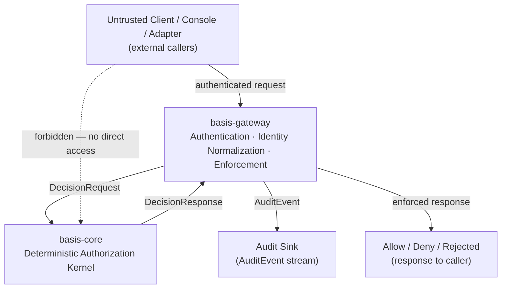

# basis-gateway Architecture

## Purpose

`basis-gateway` exists because `basis-core` is a library, not a network service. `basis-core` evaluates authorization requests in-process. Callers that are not part of the same process — enforcement points, protocol adapters, operator consoles, external integrations — need a runtime boundary that exposes kernel evaluation across a trust boundary they can reach.

`basis-gateway` is that boundary. It authenticates callers, normalizes identity context, constructs kernel-compatible decision requests, invokes `basis-core`, enforces the returned decision, and emits audit evidence. It does not evaluate policy. It does not define authorization semantics. Those responsibilities belong to the kernel.

The gateway is also where the trust boundary is enforced at the network level. Untrusted callers must never call `basis-core` directly. The kernel assumes it is receiving verified, normalized input; it has no authentication layer, no transport, and no defense against malformed callers. `basis-gateway` is the controlled entry point that provides those guarantees.

---

## Architectural Role

`basis-gateway` is the reference enforcement API and trust-boundary runtime for `basis-core`. It is the component that sits at the boundary between the systems that need authorization decisions and the kernel that produces them.

In the BASIS Core Services Distribution, `basis-gateway` occupies a specific architectural position:

- It depends on `basis-core` for policy evaluation and audit contracts.
- It depends on `basis-schemas` for shared request, response, and audit schema definitions.
- It is called by `basis-console`, protocol adapters, and any enforcement point in the deployment.
- It does not know about the field protocols those callers represent. It receives normalized requests; the normalization happened upstream.

The gateway is the reason `basis-core` can remain a library with no network surface. The gateway is the reason callers do not need to embed the kernel directly. It is the single controlled path through which untrusted callers obtain authorization decisions.

---

## Position in the BASIS Core Services Distribution

```text
BASAuth / commercial services
        ↓
basis-console  (calls gateway APIs)
        ↓
basis-gateway  ←── basis-adapters (normalize and submit requests)
        ↓
basis-core     (evaluates; returns DecisionResponse)
        ↓
basis-schemas  (shared contracts for all of the above)
```

`basis-deploy` packages `basis-gateway` alongside `basis-core`, `basis-schemas`, `basis-adapters`, and `basis-console` for deployment into OT environments. The gateway is deployment-agnostic: it should not embed assumptions about how it is packaged.

### Architecture Diagram



The dashed line is an architectural invariant, not a configuration option: untrusted callers must not reach `basis-core` directly. The gateway is the controlled path. The kernel has no authentication surface; the gateway provides it.

### Relationship to each component

**basis-core** — The gateway calls the kernel. The kernel evaluates. The gateway enforces the returned decision. The gateway does not reinterpret, override, or supplement kernel evaluation semantics. A `DENY` from the kernel is a `DENY` from the gateway.

**basis-schemas** — The gateway consumes shared schema contracts for `DecisionRequest`, `DecisionResponse`, and `AuditEvent`. It must not fork or diverge from these definitions. Schema compatibility is the kernel's domain; the gateway is a consumer.

**basis-adapters** — Adapters normalize protocol-specific messages into `DecisionRequest` objects. Adapters do not authorize independently. Depending on deployment topology, adapters may call the gateway over the network or embed the kernel directly in an edge deployment where network round-trips are not acceptable. In either case, the gateway remains protocol-agnostic: it sees normalized requests, not BACnet frames or Modbus registers.

**basis-console** — The console is a human-facing operator and administrator interface. It calls gateway APIs for policy inspection, audit log queries, and operational management. In normal deployments, the console does not bypass the gateway to call `basis-core` directly. The gateway is the console's access point to the authorization system.

**basis-deploy** — The deployment component packages the runtime. The gateway should not embed deployment assumptions. It should be possible to run `basis-gateway` in Docker Compose, on a bare VM, on an edge server, or in a Kubernetes pod without changing the gateway's code or configuration format in breaking ways.

---

## Trust Boundary Model

The trust boundary exists because `basis-core` is a library with no authentication surface of its own. The kernel assumes its callers have already authenticated. It evaluates the normalized identity and request it receives; it does not verify that the caller is who they claim to be.

If an untrusted caller could submit requests to `basis-core` directly, they could construct arbitrary `DecisionRequest` objects with fabricated subject identity and roles, bypassing the authentication and normalization that the gateway provides. The kernel would evaluate those requests faithfully.

`basis-gateway` is the controlled point at which:

- Bearer tokens and other credential material are verified against a trusted identity provider.
- Raw identity claims are normalized into `Subject` objects with verified roles.
- Requests are validated against schema contracts before reaching the kernel.
- Evaluation results are enforced: the gateway does not return a favorable response to a request the kernel denied.
- Audit evidence is emitted regardless of the decision outcome.

The trust boundary is enforced by deploying the kernel such that only `basis-gateway` (and other explicitly trusted in-process components) can reach it. In a typical deployment, `basis-core` is not accessible over the network at all. The network surface of the authorization system is `basis-gateway`.

The PoC validated one practical instantiation of this boundary: a FastAPI service that verified Keycloak-issued JWTs before reaching the policy engine. The distribution generalizes that pattern: the gateway handles authentication and token verification; the kernel handles evaluation; the two responsibilities do not mix.

---

## Core Invariants

These constraints are not implementation preferences. They are architectural invariants. A `basis-gateway` implementation that violates any of them is not a compliant gateway.

**The gateway must not reinterpret, supplement, or override authorization decisions returned by `basis-core`.**

`basis-core` owns authorization decision semantics. The kernel's `DecisionResponse` is the authoritative result of policy evaluation. Once the kernel returns a valid `DecisionResponse`, the gateway's role is enforcement, not adjudication.

Concretely:

- A `DENY` returned by the kernel is a `DENY` at the gateway. The gateway must not inspect the denial reason and selectively permit based on its own logic.
- A `NOT_APPLICABLE` outcome (no policy matched the request) is treated as `DENY`. This is the kernel's fail-closed default, and the gateway inherits it.
- The gateway must not add supplementary allow logic — no gateway-level bypass, no role shortcut, no exception list — that would permit a request the kernel denied or did not evaluate.
- The gateway must not silently succeed on a kernel error. A `failure_reason` set on the `DecisionResponse` indicates an enforcement boundary failure; the gateway fails closed.

The gateway has two pre-kernel rejection paths that are not overrides: it may reject unauthenticated requests (no valid credential) and malformed requests (schema validation failure) before reaching the kernel. Those rejections are gateway responsibilities, not semantic decisions. They prevent invalid inputs from reaching the kernel; they do not substitute for kernel evaluation.

**The kernel must receive normalized authorization inputs, not raw identity provider artifacts.**

JWT parsing, OIDC claim interpretation, and identity-provider-specific claim conventions belong at the gateway, not in the kernel. The kernel evaluates `Subject`, `Resource`, `Action`, and `IdentityContext` — normalized domain primitives. It must not depend on Keycloak, JWKS discovery, issuer metadata, or any IdP-specific claim format.

This invariant has a direct consequence for the `subject_from_jwt()` function currently in `basis-core`: see the Authentication Model section and the open question on `subject_from_jwt()` placement.

---

## Responsibilities

`basis-gateway` owns:

- **HTTP/API runtime boundary** — hosting the API surface that callers interact with, handling request routing and connection lifecycle.
- **Caller authentication** — verifying that requests come from authenticated principals before evaluation is attempted.
- **JWT/OIDC token verification** — validating Bearer tokens: signature, expiry, issuer, and claims extraction. The specific identity provider is configuration, not a hard dependency.
- **Optional mTLS caller authentication** — verifying client certificate identity as an alternative or supplement to JWT authentication, for deployments where certificate-based mutual authentication is required.
- **Identity normalization** — translating verified token claims into `Subject` objects and `IdentityContext` that the kernel can evaluate. This includes role extraction and subject type classification.
- **Request validation** — verifying that incoming requests conform to the `DecisionRequest` schema before forwarding to the kernel.
- **Construction of kernel-compatible decision requests** — assembling `DecisionRequest` objects from normalized identity context and validated request parameters.
- **Invocation of basis-core** — calling `EnforcementPoint.evaluate()` with the constructed request.
- **Enforcement of kernel decisions** — returning responses that accurately reflect kernel decisions. A `DENY` is a `DENY`. The gateway does not add permit logic on top of kernel semantics.
- **Fail-closed runtime behavior** — denying requests when authentication fails, when validation fails, when the kernel is unavailable, or when an unexpected error occurs.
- **Audit event generation and forwarding** — emitting `AuditEvent` records for every evaluated request, using the audit writer infrastructure provided by `basis-core`. The gateway may also emit gateway-level operational events (authentication failures, configuration changes) distinct from kernel decision events.
- **Health and readiness endpoints** — exposing operational status so deployment infrastructure can determine whether the gateway is functioning.
- **Metrics and observability hooks** — exposing instrumentation surfaces for deployment operators.
- **Safe integration points for future components** — maintaining a stable API surface that `basis-console`, `basis-adapters`, and external integrations can depend on.

---

## Non-Responsibilities

`basis-gateway` does not own, and must not acquire:

- **Policy evaluation semantics** — how a subject, resource, and action map to an authorization decision belongs entirely to `basis-core`.
- **Authorization decision logic** — the gateway invokes the kernel and enforces its decision; it does not implement its own allow/deny logic.
- **Kernel models** — `DecisionRequest`, `DecisionResponse`, `AuditEvent`, `Subject`, `Resource`, and related domain types are defined in `basis-core` and `basis-schemas`. The gateway imports and uses them; it does not redefine them.
- **Schema compatibility rules** — the kernel and `basis-schemas` govern what constitutes a valid schema change. The gateway adapts; it does not govern.
- **Protocol-specific OT logic** — the gateway knows nothing about BACnet, Modbus, MQTT, OPC-UA, or any other field protocol. It processes normalized requests.
- **BACnet implementation** — belongs in `basis-adapters`.
- **Modbus implementation** — belongs in `basis-adapters`.
- **MQTT broker semantics** — belongs in `basis-adapters` and infrastructure configuration.
- **Device registry ownership** — the gateway does not maintain a registry of physical devices or their properties.
- **Long-term policy authoring UI** — operator policy management interfaces belong in `basis-console` or BASAuth commercial tooling.
- **Deployment orchestration** — container management, upgrade coordination, and configuration distribution belong in `basis-deploy` and deployment infrastructure.
- **Operator console UX** — the gateway exposes APIs; `basis-console` provides the interface over them.
- **Cloud-specific infrastructure** — the gateway must not introduce hard dependencies on specific cloud providers, managed services, or cloud-native runtimes.
- **Commercial BASAuth behavior** — enterprise fleet management, managed identity federation, multi-tenancy, and commercial SLA behavior belong in BASAuth's commercial layer.

---

## Request Lifecycle

Every authorization request through `basis-gateway` follows this path:

```text
Client / Adapter / Console
    ↓
basis-gateway receives HTTP request
    ↓
Authenticate caller
    — verify Bearer token (JWT/OIDC signature, expiry, issuer)
    — or verify mTLS client certificate
    — reject with 401 if authentication fails → fail closed
    ↓
Normalize identity and context
    — extract claims from verified token
    — construct Subject with verified roles and subject type
    — construct IdentityContext for cross-boundary propagation
    ↓
Validate request
    — validate request body against DecisionRequest schema
    — reject with 400 if validation fails → fail closed
    ↓
Construct DecisionRequest
    — assemble Subject, action, resource_id, IdentityContext
    — set request_id for correlation
    ↓
Call basis-core EnforcementPoint.evaluate()
    ↓
Receive DecisionResponse
    — ALLOW, DENY, or NOT_APPLICABLE (treated as DENY)
    — check failure_reason for enforcement boundary failures
    ↓
Enforce decision
    — ALLOW: proceed with response
    — DENY: return 403 with sanitized reason
    — kernel error: return 403, fail closed
    ↓
Emit AuditEvent
    — gateway-level audit record (caller identity, request, decision)
    — forwarded via AuditWriter to configured sink
    — audit write failure does not alter the decision
    ↓
Return response to caller
```

The kernel's `EnforcementPoint` also writes its own audit record. The gateway audit record captures the caller-facing event at the gateway layer (including authentication outcomes, transport-level context); the kernel record captures the evaluation event. Both are part of the complete audit trail.

---

## API Surface — Initial Direction

The following endpoints define the initial v0.1 API direction. They are conceptual; specific request and response schemas, parameter names, and error formats are implementation decisions.

**Operational endpoints:**

```
GET  /health    — liveness probe; returns 200 if the process is running
GET  /ready     — readiness probe; returns 200 when the gateway is ready to serve requests
                  (kernel loaded, policies available, required services reachable)
GET  /metrics   — instrumentation endpoint; format is implementation-specific
```

**Authorization endpoints:**

```
POST /v1/evaluate
    — single authorization request
    — request body: DecisionRequest (action, resource_id, subject context)
    — response body: DecisionResponse (outcome, reason, request_id, policy_version)
    — authenticated; returns 401 if no valid credential, 400 if request is invalid,
      403 if denied, 200 if allowed

POST /v1/batch/evaluate
    — multiple authorization requests in a single call
    — whether this endpoint is included in v0.1 is an open question (see below)
```

The API version prefix (`/v1/`) signals that the surface is a versioned contract. Breaking changes require a version increment, not an in-place modification.

The gateway should not expose `basis-core` internals (policy engine configuration, policy rules, kernel version) through this API. Operational information of that kind belongs to a separate administrative surface, if one is warranted.

---

## Authentication Model

**JWT/OIDC normalization belongs at the gateway, not in the kernel.**

JWT and OIDC claim interpretation is runtime identity normalization. The kernel must receive normalized domain primitives — `Subject`, `IdentityContext` — not raw token payloads or IdP-specific claim structures. The gateway is the appropriate place to parse tokens, extract claims, and translate IdP-specific conventions into the kernel's subject vocabulary.

This is an architectural boundary, not an implementation preference. The kernel must not depend on Keycloak claim paths (`realm_access.roles`), JWKS endpoint conventions, issuer metadata, or any other identity-provider-specific detail. Keycloak may be used as a reference configuration in the distribution, but the kernel must remain IdP-agnostic. If the deployment changes from Keycloak to Entra ID or another provider, that change should require no modification to `basis-core`.

The consequence for `subject_from_jwt()`: this function currently resides in `basis-core.domain.subject` and assumes Keycloak/OIDC claim conventions. This is a boundary concern. See the open question on `subject_from_jwt()` placement below, and ADR-0005 in `basis-core` which formally tracks the resolution.

**JWT/OIDC as the initial authentication mode.** The gateway verifies Bearer tokens issued by an OIDC-compatible identity provider. Verification includes: signature validation against the provider's JWKS endpoint, expiry check, and issuer claim validation. The provider is configuration. Keycloak is the reference configuration for the distribution; the gateway must also accommodate other OIDC providers without code changes.

**JWKS caching.** The gateway should cache JWKS responses from the identity provider and refresh on a configurable interval, with a forced refresh on encountering an unknown `kid`. This prevents per-request latency while accommodating key rotation. The PoC validated this pattern; it should carry forward.

**Identity normalization after token verification.** Once a token is verified, the gateway translates the verified claims into a `Subject` and `IdentityContext` using the domain types defined in `basis-core`. This normalization step — extracting subject ID, name, type, and roles from the token — is entirely a gateway responsibility. The kernel receives the normalized output; it does not participate in the translation.

**Optional mTLS.** Certificate-based mutual authentication is appropriate for machine-to-machine paths where JWT issuance is impractical. mTLS is an authentication mode, not a substitute for identity normalization: a verified certificate identity must still be mapped to a `Subject` before reaching the kernel. Whether mTLS is included in v0.1 is an open question.

**What the gateway does not own.** The gateway verifies credentials; it does not issue them. It does not operate an identity provider, manage LDAP connections, administer Keycloak realms, or participate in certificate authority operations. Those responsibilities belong to deployment infrastructure and, in commercial deployments, to BASAuth managed services.

---

## Audit Model

The gateway emits runtime audit evidence for every evaluated request. Audit at the gateway layer captures what callers sent and what the gateway decided to do with it.

The audit record structure must align with `basis-core`'s `AuditEvent` schema and `basis-schemas` contracts. The gateway must not introduce parallel audit schemas or produce audit events that diverge from the canonical field definitions.

**What gateway audit records capture:**

- Caller identity as verified at the gateway (subject, subject type, roles extracted from token)
- The request: action, resource_id, request_id
- The decision returned to the caller: allowed or denied
- The reason for the decision (sanitized; no kernel internals)
- Timestamp and schema version
- Correlation IDs for cross-system tracing

**What audit is not.** Audit is evidence, not enforcement. An audit write failure does not reverse a decision already returned to the caller. The gateway inherits this contract from the kernel: `AuditWriter.write()` failures are caught, logged as operational incidents, and do not alter the decision path.

**Audit sinks.** The gateway uses `basis-core`'s `AuditWriter` protocol for its own audit events. The specific sink (log pipeline, database, SIEM) is a deployment concern. `LogAuditWriter` is appropriate for development; production deployments need an `AuditWriter` that provides append-only semantics and survives process restarts.

**Audit gaps.** If an audit write fails, the decision stands but no record is written. Audit gaps must be monitored and treated as operational incidents. The gateway should expose instrumentation that makes audit write failures visible.

---

## Failure Semantics

The gateway fails closed. In every ambiguous or error condition, the safe behavior is to deny the request.

| Condition | Gateway behavior |
|---|---|
| Missing or malformed Authorization header | 401, no evaluation |
| Token signature invalid | 401, no evaluation |
| Token expired | 401, no evaluation |
| Token issuer mismatch | 401, no evaluation |
| Request body fails schema validation | 400, no evaluation |
| basis-core returns DENY | 403, reason from kernel (sanitized) |
| basis-core returns NOT_APPLICABLE | 403, treated as DENY |
| basis-core EnforcementPoint raises | 403, fail closed |
| basis-core unavailable (kernel not loaded) | 503 or 403, fail closed |
| Unexpected internal error in gateway | 500, but safe denial; no authorization proceeds |
| Audit write failure | Decision stands; failure logged as operational incident |

**Raw errors must not reach callers.** Stack traces, internal exception messages, and policy internals must not appear in responses. The gateway inherits the kernel's contract on this: callers receive sanitized denial reasons.

**Audit failure behavior — open design question.** The kernel's stance is clear: audit failure does not affect the decision. Whether the gateway should additionally alert on audit failures, increment a metric, or take other operational action is a deployment concern not fully specified here. This should be resolved before v0.1 release.

---

## Compatibility Considerations

The gateway is downstream of the kernel's compatibility contracts. Any change the gateway makes to how it constructs `DecisionRequest` objects, interprets `DecisionResponse` outcomes, or emits `AuditEvent` records carries compatibility weight.

Specifically:

- The gateway must not add fields to `DecisionRequest` that the kernel's schema does not recognize.
- The gateway must not interpret `DecisionResponse` outcomes in ways that differ from the kernel's defined semantics.
- The gateway must not emit `AuditEvent` records that diverge from the `basis-schemas` audit schema. It must include `schema_version` on every event.
- The gateway's own API versioning (e.g., `/v1/evaluate`) must be managed with the same discipline as the kernel's compatibility surfaces: additive changes are acceptable under a minor version; breaking changes require a version increment and a defined migration path.
- The gateway must not introduce evaluation logic that callers come to depend on as if it were kernel behavior. If callers need different evaluation semantics, that discussion belongs in `basis-architecture` and `basis-core`.

---

## Deployment Assumptions

`basis-gateway` should be deployment-agnostic. The following assumptions are intentional:

- No mandatory dependency on Kubernetes, Helm, or cloud-native container orchestration.
- Deployable in Docker Compose (as the PoC demonstrated), on a bare VM, on an edge server with limited resources, or in Kubernetes later.
- No cloud provider SDK dependencies. Cloud-specific sinks (CloudWatch, GCS, Azure Monitor) are deployment configuration, not gateway dependencies.
- No embedded assumptions about high-availability topology. The gateway should be deployable as a single instance (appropriate for many OT edge deployments) and scalable horizontally without requiring changes to gateway code.
- Configuration via environment variables and/or a configuration file; the specific mechanism is an implementation decision.

The PoC's ADR-0008 (no Kubernetes dependency) and ADR-0006 (local-first architecture) are the correct reference points for this philosophy. The gateway should carry that philosophy forward.

---

## Initial v0.1 Scope

The following capabilities define the intended scope of `basis-gateway` v0.1:

- Single-request authorization via `POST /v1/evaluate`
- JWT/OIDC Bearer token authentication against a configurable OIDC provider
- Identity normalization into `basis-core` `Subject` objects
- `DecisionRequest` construction and kernel invocation via `EnforcementPoint`
- `DecisionResponse` enforcement (ALLOW/DENY/NOT_APPLICABLE handling)
- `AuditEvent` emission via `basis-core` `AuditWriter` protocol
- Fail-closed behavior on all error conditions
- Health (`GET /health`) and readiness (`GET /ready`) endpoints
- Basic metrics endpoint (`GET /metrics`)
- Configuration via environment variables for identity provider URL, realm, and kernel policy path

---

## Explicitly Out of Scope for v0.1

- Batch evaluation (`POST /v1/batch/evaluate`)
- mTLS caller authentication
- Policy distribution service (pushing policy updates to remote enforcement points)
- Request caching or local policy cache management
- Rate limiting
- Administrative API (policy management, user management)
- WebSocket or streaming evaluation paths
- Integration with external SIEM or audit aggregation systems beyond `LogAuditWriter`
- High-availability configuration or cluster-aware behavior
- BASAuth commercial integrations

---

## Open Questions

The following questions are unresolved and should be addressed during design and early implementation. They are recorded here to prevent accidental resolution through unchecked implementation choices.

**1. Language and runtime**
Should `basis-gateway` be implemented in Python or Go?

Python aligns with `basis-core` (which is Python) and simplifies direct in-process import of the kernel. Go provides better performance characteristics for a network service, broader tooling for HTTP APIs, and a smaller runtime footprint for edge deployments. The tradeoff between kernel proximity and runtime performance is a real design question. If Go is chosen, the gateway calls the Python kernel via an inter-process mechanism, which introduces latency and operational complexity.

**2. Evaluation modes: direct embedding vs. network proxy**
Should the gateway embed `basis-core` as a library (in-process) or call it as a separate service (network proxy)?

In-process embedding is simpler, lower latency, and avoids network dependencies between the gateway and the kernel. A proxy model allows the kernel to be independently deployed and scaled, but introduces network latency in the authorization hot path, which may be unacceptable in OT environments with strict latency requirements.

The PoC ran the kernel in-process within the API service. For v0.1, in-process embedding is the natural starting point.

**3. Audit sink failure behavior**
If the configured `AuditWriter` fails repeatedly, should the gateway continue serving requests (accepting audit gaps) or degrade to deny-all until the audit pipeline is restored?

Continuing to serve preserves operational access but creates silent audit gaps. Degrading to deny-all is operationally safer from a compliance standpoint but may be unacceptable in OT environments where access continuity is a safety requirement. This is a deployment-dependent tradeoff that the architecture should define a position on, even if that position is "configurable."

**4. Batch evaluation in v0.1**
Protocol adapters may benefit from submitting multiple authorization requests in a single network round-trip. Is `POST /v1/batch/evaluate` a v0.1 requirement or a later addition?

Including it in v0.1 adds complexity but may significantly reduce latency for adapter-heavy deployments. Excluding it keeps v0.1 simple but may require a breaking API change to introduce later if the single-request endpoint cannot cleanly evolve to support batch semantics.

**5. mTLS as v0.1 or later**
mTLS is particularly relevant for machine-to-machine paths (adapter-to-gateway) in environments where JWT issuance is not practical. Is the operational case for mTLS strong enough to warrant v0.1 implementation, or is JWT sufficient for initial deployments?

**6. Adapter integration pattern**
Should adapters call the gateway over the network (gateway-as-service) or embed the kernel directly (in-process adapter)? The answer may vary by deployment topology:

- Network call through gateway: simpler operational model, single audit pipeline, but adds network latency.
- In-process kernel: lower latency, but requires the adapter process to manage its own kernel configuration and audit path.

Both patterns should be architecturally supported. The gateway should not assume it is the only path to the kernel.

**7. subject_from_jwt placement**
`basis-core` currently includes `subject_from_jwt()` in `basis_core.domain.subject`, but it assumes a Keycloak/OIDC JWT structure. This is a kernel boundary violation: JWT claim interpretation is an IdP-specific runtime concern that belongs at the gateway, not in the authorization kernel. This is formally tracked in `basis-core` as ADR-0005. The gateway implementation must not build dependencies on the current import path of `subject_from_jwt()` — the function is expected to move, be deprecated, or be replaced by a gateway-owned normalization step before `basis-gateway` v0.1 is considered stable.

---

## Related Documents

- [`docs/architecture/basis-ecosystem.md`](basis-ecosystem.md) — component responsibilities, dependency direction, what basis-gateway owns in the distribution
- [`docs/kernel-boundary-rules.md`](../kernel-boundary-rules.md) — what belongs in basis-core and what must stay outside it
- [`docs/architecture/compatibility-philosophy.md`](compatibility-philosophy.md) — compatibility commitments that govern the gateway's API surface and audit schema usage
- [`docs/architecture/action-vocabulary.md`](action-vocabulary.md) — action naming conventions that gateway-level request validation should enforce
- [`docs/architecture/reference-vs-implementation.md`](reference-vs-implementation.md) — the distinction between basis-poc (historical reference) and basis-gateway (the designed component)
- `docs/adr/ADR-0005-move-jwt-normalization-outside-kernel.md` in `basis-core` — the boundary decision on `subject_from_jwt()` and JWT/OIDC normalization ownership
- `docs/public-api.md` in `basis-core` — the stable public API surface the gateway calls into
- `docs/enforcement-boundary.md` in `basis-core` — the guarantees the EnforcementPoint provides
- `docs/audit-model.md` in `basis-core` — the audit event model and AuditWriter contract
- `docs/failure-modes.md` in `basis-core` — failure conditions and kernel behavior the gateway must handle
- `docs/schema-contracts.md` in `basis-core` — schema stability rules for DecisionRequest, DecisionResponse, and AuditEvent
