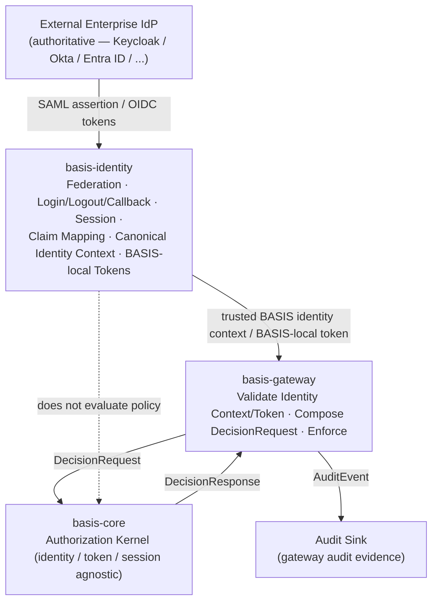

# basis-identity Architecture

## Purpose

`basis-identity` exists because identity in an OT authorization system arrives in many external forms and must leave in exactly one internal form. Enterprise identity providers, vendor identity systems, and federation protocols each present identity differently — different token formats, different claim names, different assertion shapes, different session and login conventions. `basis-core` cannot evaluate any of them directly: the kernel evaluates normalized `Subject` and `IdentityContext` inputs and nothing else. Something must stand between the external identity world and the BASIS authorization world and reconcile the two.

`basis-identity` is that component. It is the **BASIS identity engine and federation boundary**: the component that integrates external identity providers, brokers and federates identity into the ecosystem, owns the login/logout/callback flows and BASIS-local sessions that arise from that integration, normalizes external claims into canonical BASIS identity context, and — where a deployment requires it — issues BASIS-local tokens that downstream BASIS components can trust.

It does not decide what a subject is allowed to do. It does not store policy, evaluate policy, or return authorization decisions. It establishes *who the subject is* in canonical BASIS terms; `basis-core` decides *what that subject may do*, and `basis-gateway` enforces that decision at the runtime boundary.

---

## What basis-identity Is — and Is Not

`basis-identity` is **not an authoritative enterprise identity provider by default**. It is not, and is not intended to replace, Keycloak, Okta, Microsoft Entra ID, Auth0, Ping, ADFS, LDAP, or any other enterprise identity source. In the default and primary deployment posture those systems remain the authoritative origin of user accounts, credentials, multi-factor enrollment, directory membership, and the lifecycle of enterprise identity; `basis-identity` does not own the enterprise user directory, and a deployment's source of truth for *who exists* stays where the organization already keeps it.

The one bounded exception is an explicitly configured standalone or air-gapped deployment, where no external IdP is reachable and `basis-identity` is deliberately made the deployment-local identity authority. This is a constrained, opt-in operating mode — not a general-purpose enterprise IdP replacement — and it is defined precisely in [`docs/architecture/identity-authority-modes.md`](identity-authority-modes.md). The accurate statement of the boundary is therefore: `basis-identity` is not an authoritative enterprise IdP by default, but it may act as the local identity authority for explicitly configured standalone or air-gapped BASIS deployments.

What `basis-identity` *is* is the BASIS-side identity engine that sits in front of those authoritative providers and integrates them into the BASIS ecosystem. It:

- integrates external identity providers,
- may act as a **SAML Service Provider**,
- may act as an **OIDC relying party**,
- may broker and federate identity across one or more upstream providers,
- may own the **login, logout, and callback** flows that federation requires,
- may manage **BASIS-local sessions**,
- may normalize provider claims into **canonical BASIS identity context**,
- may issue **BASIS-local tokens** for downstream BASIS components,
- and provides **identity diagnostics** and mapping visibility into how external identity becomes BASIS identity.

### The Keycloak-as-broker analogy

The architectural role `basis-identity` occupies is the same role Keycloak (or a comparable identity broker) commonly plays when it is deployed *in front of* a set of SaaS or internal applications. In that pattern, Keycloak is not the enterprise's authoritative directory — the enterprise IdP (Entra ID, Okta, ADFS, an LDAP directory) remains authoritative. Keycloak acts as a Service Provider / relying party toward those upstream IdPs, brokers their identities, runs the login and callback flows, holds a local session, normalizes the incoming assertions into a consistent token its downstream applications understand, and issues that token to those applications. The applications trust Keycloak's token; Keycloak trusts the upstream IdP.

`basis-identity` plays that broker / Service-Provider role for the BASIS ecosystem specifically. External enterprise IdPs remain authoritative. `basis-identity` integrates and brokers them, and presents downstream BASIS components (principally `basis-gateway`) with a single, normalized, canonical identity context — and, when configured, a BASIS-local token — rather than requiring each BASIS component to integrate every upstream provider directly.

This analogy describes an architectural role, not an implementation mandate. `basis-identity` is not Keycloak and does not reimplement it. A deployment may even run Keycloak (or another broker) as one of the upstream providers `basis-identity` integrates. The point of the analogy is the *position in the trust chain*: authoritative IdP → identity broker / Service Provider → downstream consumers.

---

## Architectural Role

`basis-identity` is the federation and normalization boundary between external identity systems and the BASIS authorization runtime. It occupies a defined position in the ecosystem:

- It integrates **external, authoritative identity providers** as upstream systems. They remain the source of truth for accounts and credentials.
- It produces **canonical BASIS identity context** — the normalized `Subject` and `IdentityContext` representation that `basis-core` is designed to evaluate and that `basis-schemas` is expected to formalize.
- It is consumed primarily by **`basis-gateway`**, which validates the trusted BASIS identity context or BASIS-local token that `basis-identity` produces, composes the `DecisionRequest`, and invokes the kernel.
- It does not depend on `basis-core` for its own behavior. Identity integration and normalization are upstream of evaluation; the kernel does not call back into identity.

The relationship between the three identity-relevant components can be stated as a separation of three distinct questions:

- **`basis-identity` answers "who is this, in canonical BASIS terms?"** — federation, login, session, claim mapping, subject resolution, canonical identity context, and (when appropriate) BASIS-local token issuance.
- **`basis-gateway` answers "is this request, from this verified identity, permitted — and is it enforced?"** at the runtime boundary — validating the trusted identity context/token, composing the `DecisionRequest`, invoking `basis-core`, returning the decision, and emitting gateway audit evidence.
- **`basis-core` answers "does policy permit this subject-resource-action?"** — and remains identity-provider agnostic, token agnostic, and session agnostic.

### Position in the BASIS ecosystem

```text
External enterprise IdPs (authoritative)
  Keycloak · Okta · Entra ID · Auth0 · Ping · ADFS · LDAP · SAML/OIDC sources
        ↓  (SAML SP / OIDC relying party · federation · login/logout/callback)
basis-identity   (identity engine · federation boundary · claim mapping ·
                  session · canonical identity context · BASIS-local tokens)
        ↓  (trusted BASIS identity context / BASIS-local token)
basis-gateway    (validates identity context/token · composes DecisionRequest ·
                  invokes kernel · enforces · emits audit evidence)
        ↓  (DecisionRequest)
basis-core       (evaluates; identity-provider / token / session agnostic)
        ↓
basis-schemas    (shared contracts, including the canonical identity context shape)
```

### Architecture diagram



The dashed line is an architectural invariant: `basis-identity` establishes identity but does not make or influence authorization decisions. It never calls `basis-core` to authorize, and the kernel never depends on identity-provider, token, or session details.

---

## Responsibilities

`basis-identity` owns the following. Several are stated with "may" because whether a given capability is active depends on deployment configuration (which federation protocol is in use, whether BASIS-local tokens are issued, and so on); the ownership is `basis-identity`'s in every case where the capability is present.

- **Federation** — integrating one or more external, authoritative identity providers and brokering identity from them into the BASIS ecosystem. This includes acting as a SAML Service Provider and/or an OIDC relying party.
- **Login, logout, and callback flows** — owning the redirect, assertion-consumption, callback, and logout flows that federation with external providers requires.
- **BASIS-local sessions** — establishing and managing the sessions that result from a successful federated login, independent of the upstream provider's own session.
- **Token exchange** — exchanging and validating upstream provider artifacts (SAML assertions, OIDC tokens) and, where configured, exchanging them for BASIS-local tokens.
- **Claim mapping** — normalizing provider-specific claims, assertions, and attribute names into the canonical BASIS claim vocabulary.
- **Subject resolution** — resolving an authenticated principal into a canonical BASIS subject (subject identifier, subject type, roles, and relevant attributes).
- **Canonical identity context** — producing the normalized `IdentityContext` / `Subject` representation that downstream BASIS components consume. This is the single internal form of identity that the rest of the ecosystem relies on.
- **BASIS-local token issuance when appropriate** — issuing tokens that downstream BASIS components (principally `basis-gateway`) can validate and trust as carrying canonical BASIS identity context. This is done only when a deployment is configured for it; it does not replace upstream credential authority.
- **Identity diagnostics** — providing visibility into how external identity becomes BASIS identity: which provider authenticated a subject, how claims were mapped, where mapping gaps or ambiguities exist, and what canonical context was produced. Diagnostics are an explanatory and operational surface, not an authorization surface.

---

## Non-Responsibilities

`basis-identity` does not own, and must not acquire:

- **Enterprise user directory authority** — the authoritative source of user accounts, credentials, group membership, and identity lifecycle remains the external enterprise IdP. `basis-identity` integrates that authority; it does not become it.
- **Password storage** — in federated and synchronized deployments, credentials live in the external IdP, not in `basis-identity`. There are two bounded exceptions where local credential verification is legitimate: an explicitly configured **standalone / air-gapped local authority mode**, in which `basis-identity` is the deployment-local identity authority because no external IdP is reachable; and a **local development/demo mode** that exists only to make the system runnable without an upstream provider. The first is a constrained production mode for isolated OT environments; the second is never a model for production authority. Both are defined in [`docs/architecture/identity-authority-modes.md`](identity-authority-modes.md).
- **Authorization evaluation** — deciding whether a subject may perform an action is `basis-core`'s responsibility.
- **Policy decisions** — policy definition, evaluation semantics, and decision outcomes belong to `basis-core`.
- **OT protocol normalization** — translating BACnet, Modbus, MQTT, OPC UA, or any field protocol into the authorization vocabulary belongs to `basis-adapters`.
- **Gateway enforcement** — validating the request at the runtime boundary, composing the `DecisionRequest`, invoking the kernel, and enforcing the returned decision belong to `basis-gateway`.
- **Audit storage** — `basis-identity` may emit identity-related events, but the authorization audit trail and its persistence are owned by `basis-gateway` and `basis-core` (and downstream storage), not by the identity engine.
- **Operator console workflows** — operator- and administrator-facing policy inspection, audit review, and operational workflows belong to `basis-console`.
- **Deployment orchestration** — packaging, configuration distribution, and upgrade tooling belong to `basis-deploy`.

The distinguishing test is the same one that governs the rest of the ecosystem: if a capability concerns *establishing who a subject is in canonical BASIS terms* — by integrating, brokering, normalizing, or explaining external identity — it may belong in `basis-identity`. If it concerns *what a subject may do*, *how a field protocol is normalized*, *how a decision is enforced*, or *how the system is operated or deployed*, it belongs in another component.

---

## Responsibility Boundaries Across the Ecosystem

The introduction of `basis-identity` as the identity engine sharpens, but does not change, the responsibilities of the adjacent components. The boundaries below are stated together so they can be read as one contract.

### basis-identity owns

Federation; login/logout/callback flows; BASIS-local sessions; token exchange; claim mapping; subject resolution; canonical identity context; identity diagnostics; and BASIS-local token issuance when appropriate.

### basis-gateway owns

The authorization enforcement boundary; validating the trusted BASIS identity context or BASIS-local token presented to it; composing the `DecisionRequest`; invoking `basis-core`; returning decisions; and emitting gateway audit evidence. The gateway is the runtime trust boundary in front of the kernel: it trusts canonical identity context produced by `basis-identity` (or, in deployments without `basis-identity`, identity it verifies directly), and it does not re-run federation or claim mapping itself. See [`docs/architecture/basis-gateway.md`](basis-gateway.md).

### basis-core remains

Identity-provider agnostic, token agnostic, session agnostic, and authorization-only. The kernel evaluates normalized `Subject`, `Resource`, `Action`, and `IdentityContext` inputs and produces a deterministic decision. It does not know which IdP authenticated the subject, whether a BASIS-local token was issued, or whether a session exists. Those concerns are resolved upstream — by `basis-identity` and `basis-gateway` — before the kernel is ever invoked.

This separation is what allows each component to remain stable. `basis-core` stays small and portable because it never absorbs identity-provider detail. `basis-gateway` stays a clean enforcement boundary because it consumes a normalized identity context rather than integrating every upstream provider. `basis-identity` can integrate, broker, and normalize arbitrarily many external providers without ever touching policy semantics.

---

## Identity Authority Modes

Where the *authoritative* record of identity lives is a separate question from how much federation machinery `basis-identity` runs. `basis-identity` may support multiple identity authority modes, but **each deployment chooses one primary identity authority model**. The supported modes are:

- **Federated mode** — an external IdP (Okta, Entra ID, Keycloak, Auth0, Ping, ADFS, other SAML/OIDC sources) is authoritative; `basis-identity` brokers and normalizes identity from it and may keep shadow/profile records for diagnostics, mapping, access review, and audit context. This is the primary, default enterprise mode.
- **Synchronized registry mode** — an external IdP remains authoritative, but `basis-identity` maintains a local synchronized registry (via SCIM push, periodic import, or controlled offline bundle import) for diagnostics, access review, mapping, and limited offline resilience. The registry must not silently diverge from the authoritative source.
- **Standalone / air-gapped local authority mode** — for OT environments where no external IdP is reachable, `basis-identity` is deliberately made the *deployment-local* identity authority and may own local users, groups, credential verification, sessions, token issuance, and lifecycle state. This authority is deployment-local only and is not a general-purpose enterprise IdP replacement.

These modes, the login-experience principle, the rules for mixing modes (one primary mode plus explicit, bounded exceptions such as break-glass admins), and the convergence of all modes into one canonical identity context are defined in full in [`docs/architecture/identity-authority-modes.md`](identity-authority-modes.md).

---

## Deployment Models

The authority modes above describe *where identity originates*; the deployment models below describe *how much of the federation and session surface* `basis-identity` operates. The two are complementary: a deployment selects an authority mode and instantiates a federation surface to match it. `basis-identity` is an architectural role, and deployments may instantiate it to different degrees:

- **Full federation deployment** — `basis-identity` acts as a SAML SP and/or OIDC relying party in front of one or more enterprise IdPs, owns the login/logout/callback flows and BASIS-local sessions, normalizes claims, and issues BASIS-local tokens that `basis-gateway` validates. This is the broker pattern described above and is the primary intended model.
- **Normalization-only deployment** — an existing broker or gateway already terminates federation, and `basis-identity` is used for claim mapping, subject resolution, and canonical identity context production without owning the login flow. The canonical-context contract is the same; the federation surface is narrower.
- **Standalone / air-gapped deployment** — no external IdP is reachable, so `basis-identity` operates in local authority mode and owns the local accounts, sessions, and (where configured) tokens itself. This is a constrained but legitimate production mode for isolated OT environments, and is the deployment realization of the standalone / air-gapped authority mode above.
- **Local development / demo mode** — `basis-identity` is explicitly configured with local credentials so the ecosystem can run end-to-end without an upstream provider. Unlike standalone / air-gapped deployments, this mode exists for development and demonstration only and is never a model for production identity authority.

In every model, the canonical identity context that `basis-identity` produces is the stable contract the rest of the ecosystem depends on. What varies is how much of the federation and session surface `basis-identity` operates in that deployment.

---

## Relationship to the Authority Boundary

A recurring source of confusion in identity architectures is conflating *integration authority* with *directory authority*. `basis-identity` holds the former and never the latter.

- **Directory authority** — who exists, what their credentials are, how they authenticate, and how their accounts are provisioned and deprovisioned — remains with the external enterprise IdP in federated and synchronized modes. `basis-identity` defers to it. The deliberate exception is standalone / air-gapped local authority mode, where there is no external IdP to defer to and `basis-identity` holds directory authority for that one isolated deployment.
- **Integration authority** — how that externally-authenticated identity is brokered, normalized, sessioned, and represented inside BASIS — is `basis-identity`'s. Within BASIS, `basis-identity` is the authority on what the canonical identity context for a federated subject is.

Keeping these distinct is what makes the Keycloak-as-broker analogy precise: a broker is authoritative over *its own normalized representation and session*, while remaining a downstream consumer of the *upstream IdP's authoritative accounts*. In federated and synchronized modes `basis-identity` is authoritative in exactly that bounded sense and no further; in standalone / air-gapped mode it additionally — and only for that deployment — holds the directory authority that no reachable external IdP can provide. The authority modes are defined in [`docs/architecture/identity-authority-modes.md`](identity-authority-modes.md).

---

## Relationship to basis-schemas

The canonical identity context that `basis-identity` produces is a cross-component contract: `basis-gateway` and `basis-core` both depend on its shape. As with the action vocabulary and resource-identifier contracts, the canonical identity context is expected to be formalized under a future `basis-schemas`. Until then, `basis-identity` is the architectural owner of how external identity is normalized into canonical BASIS form, and this document is the reference for that boundary. The normalization targets `basis-identity` maps *into* are expected to align with the `Subject` and `IdentityContext` contracts that `basis-schemas` will publish.

---

## Summary

`basis-identity` is the BASIS identity engine and federation boundary. It integrates external, authoritative identity providers — without replacing them — and brokers, normalizes, sessions, and (when configured) tokenizes identity into the single canonical form the rest of the ecosystem consumes. Its architectural role mirrors how an identity broker such as Keycloak is deployed in front of applications: authoritative IdPs upstream, normalized identity downstream. It owns federation, login/logout/callback, sessions, token exchange, claim mapping, subject resolution, canonical identity context, identity diagnostics, and BASIS-local token issuance when appropriate. A deployment chooses one primary identity authority mode — federated, synchronized registry, or standalone / air-gapped local authority — as defined in [`docs/architecture/identity-authority-modes.md`](identity-authority-modes.md); only in the explicitly configured standalone / air-gapped mode does `basis-identity` hold deployment-local directory authority. By default it does not own enterprise directory authority, and in no mode does it own authorization evaluation, policy, OT protocol normalization, gateway enforcement, audit storage, console workflows, or deployment orchestration. `basis-gateway` validates the trusted identity context it produces and enforces decisions at the runtime boundary; `basis-core` evaluates policy while remaining identity-provider, token, and session agnostic.
