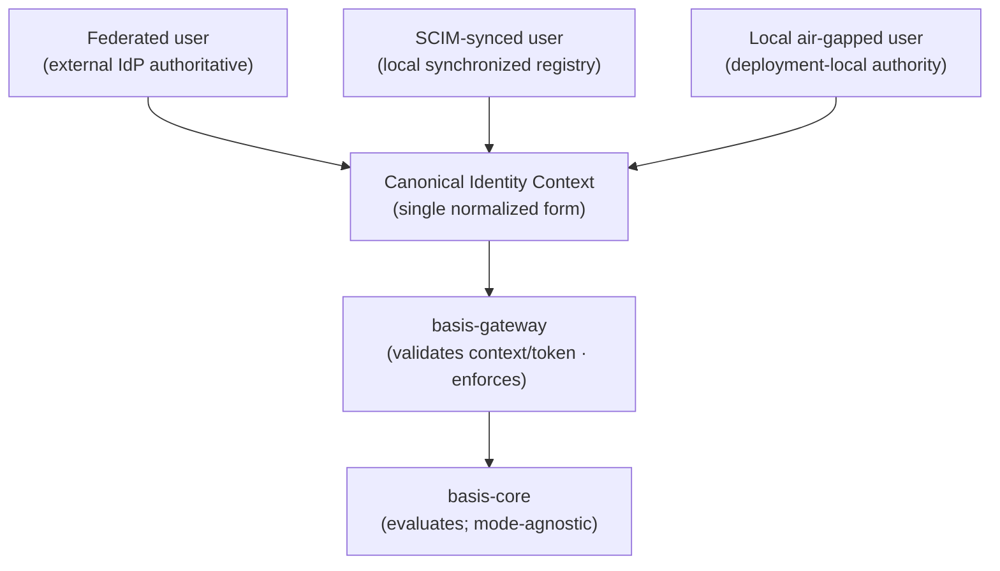

# Identity Authority Modes

## Purpose

`basis-identity` integrates external identity into the single canonical form the BASIS ecosystem consumes (see [`docs/architecture/basis-identity.md`](basis-identity.md)). But "integrate external identity" presumes there is always a reachable external identity source to integrate, and in operational technology that presumption does not hold uniformly. Some BASIS deployments sit behind a corporate IdP that is authoritative and continuously reachable. Some sit behind an IdP that is authoritative but only intermittently reachable, and need a local synchronized copy to keep functioning. Some sit in air-gapped or standalone environments where no external IdP exists at all, and identity has to originate locally or not at all.

This document defines the **identity authority modes** that account for that range. The question each mode answers is narrow and specific: *where is the authoritative source of who exists?* That is distinct from the federation-surface question — how much of the login, session, and token machinery `basis-identity` operates — which is covered by the deployment models in [`docs/architecture/basis-identity.md`](basis-identity.md#deployment-models). A deployment picks an authority mode and, somewhat independently, instantiates a federation surface to match it.

The modes exist to give OT deployments a clear, bounded set of entry points into BASIS without expanding `basis-identity` into an unbounded, general-purpose IAM platform. They define what `basis-identity` is *allowed* to be authoritative over in a given deployment, and — just as importantly — what it is not.

---

## Core principle

```text
basis-identity may support multiple identity authority modes,
but each deployment chooses one primary identity authority model.
```

A deployment is configured for one primary authority mode. That choice determines where the authoritative record of identity lives, what `basis-identity` is permitted to own locally, and how users enter the system. Mixing is possible but constrained, and is addressed explicitly below. The reason for a single primary mode is the same reason the rest of the ecosystem favors single, explicit boundaries: a deployment where identity could authoritatively originate in several places at once is a deployment where no one can answer "who is authoritative for this account?" — and that ambiguity is precisely what an authorization system must not have at its root.

---

## The three modes

### 1. Federated mode

An external identity provider is authoritative. `basis-identity` integrates it and brokers identity from it, but never originates accounts or credentials.

Representative upstream providers include Okta, Microsoft Entra ID, Keycloak, Auth0, Ping, ADFS, and other SAML or OIDC sources.

In this mode `basis-identity` acts as an OIDC relying party and/or a SAML Service Provider, an identity broker, a claim mapper, a subject normalizer, and — where the deployment requires it — the session and token boundary for BASIS. It may store shadow or profile records: a local projection of an external identity kept for diagnostics, claim-mapping visibility, access review, and audit context. Those records are derived from the authoritative provider; they are not the authority.

What `basis-identity` does **not** own in federated mode: enterprise accounts, credentials, MFA policy, and identity lifecycle authority. Those remain with the external IdP, which is the source of truth for *who exists* and *how they authenticate*. This is the primary, default mode for enterprise deployments.

### 2. Synchronized registry mode

An external IdP or identity source remains authoritative, but `basis-identity` maintains a **local synchronized registry** — a maintained local copy of identity data kept in step with the authoritative source.

Representative mechanisms include SCIM push from Okta or Entra ID, periodic identity import from an upstream directory, and controlled offline identity-bundle import for environments that receive identity data on a deliberate cadence rather than continuously.

In this mode `basis-identity` may store users, groups, external identifiers, mapped roles, lifecycle state, synchronization metadata, and last-seen / last-synced timestamps. This local registry supports diagnostics, access review, claim mapping, and limited offline resilience — the deployment can keep evaluating identity even when the upstream source is briefly unreachable.

The defining constraint is fidelity to the authoritative source: the synchronized registry **must not silently diverge** from it. Divergence — through stale data, dropped sync events, or unreconciled local edits — must be detectable and surfaced, not hidden. The registry is a maintained replica, not a second authority.

### 3. Standalone / air-gapped local authority mode

`basis-identity` is **locally authoritative** for a specific standalone or air-gapped BASIS deployment. This mode exists because some OT environments genuinely cannot depend on a reachable external IdP — isolated plants, disaster-recovery sites, labs, and air-gapped control networks where no upstream provider is reachable by design.

In this mode, and only in this mode, `basis-identity` may own local users, local groups, local credential verification, local sessions, local token issuance, and local lifecycle state. That ownership is real: within the deployment, `basis-identity` is the authoritative source of who exists.

The boundaries on that authority are equally real:

- The authority is **deployment-local only**. It is authoritative for one standalone or air-gapped deployment, not across deployments and not for the enterprise at large.
- It is **not** a general-purpose enterprise IdP replacement. It does not become Okta or Entra ID for an organization; it is the local identity authority for an isolated BASIS instance.
- It is an **explicit, configured operating mode** — never the default and never an accident of configuration. A deployment is in local authority mode because an operator deliberately put it there.
- It is a **constrained mode** that should be documented and presented as such, so that operators understand they are running BASIS as its own identity authority rather than deferring to an enterprise source.

This mode is what makes BASIS deployable in environments that earlier, federation-only framings of `basis-identity` could not serve. It does not weaken the federated and synchronized modes; it sits beside them as the option of last resort when no external authority is reachable.

---

## Login experience

```text
The deployment chooses the login experience.
The user should not be asked to understand the identity architecture.
```

The authority mode is an architectural fact. It should not be pushed onto the person signing in. A user should encounter a login experience that matches how their deployment is configured, expressed in terms they already understand — not a menu of identity mechanisms they are expected to choose between.

- A federated deployment presents something like **"Sign in with your organization,"** which routes to the authoritative IdP.
- An air-gapped or standalone deployment presents something like **"Sign in to BASIS,"** because there is no external organization to defer to.
- A hybrid or emergency deployment keeps the exceptional path out of the way — local or break-glass login is reached through something like **"Emergency access,"** not offered as a co-equal everyday option.

The anti-pattern to avoid is a login surface that exposes every configured mechanism to every user — organization SSO, local accounts, emergency access, and imported identities all presented side by side. That forces users to understand the identity architecture in order to log in, and it widens the everyday attack surface. The deployment knows its primary mode; the login experience should reflect that one mode and keep the exceptions appropriately hidden. (This document states the principle only; login page design and flow details belong to implementation phases, not to the architecture.)

---

## Mixing modes

A deployment should have **one primary identity authority mode**. Exceptions exist, but they must be explicit, bounded, and deliberately configured — not the result of casually enabling several login methods for the same population of users.

Acceptable, well-bounded combinations include:

- **Federated mode plus a local break-glass admin** — the enterprise IdP is authoritative for everyone, with a single deliberately-provisioned local administrator account reserved for the case where the IdP itself is unreachable.
- **Synchronized registry plus an emergency local account** — the synchronized copy serves normal operation, with a narrowly-scoped local account available when sync or upstream connectivity fails.
- **Air-gapped mode plus an offline imported identity bundle** — the deployment is locally authoritative, augmented by identity data brought in through a controlled offline import.

What these share is that the secondary path is a defined, constrained exception to a clearly primary mode, with an understood reason for existing. What to avoid is the opposite: many login methods offered to the same user population with no primary mode, so that any given user might be authoritative in two places at once. The first is a break-glass design; the second is an ambiguity the system cannot reconcile.

---

## Canonical convergence

Whatever mode produced an identity, the downstream representation is the same. A federated user, a SCIM-synced user, and a local air-gapped user all converge into one canonical identity context before any BASIS component downstream of `basis-identity` sees them.

```text
Federated user
SCIM-synced user
Local air-gapped user

        ↓

Canonical Identity Context

        ↓

basis-gateway

        ↓

basis-core
```



This convergence is what keeps the authority modes from leaking into the rest of the ecosystem. `basis-gateway` validates a trusted identity context or BASIS-local token and enforces the resulting decision; it does **not** need to know whether the identity originated from Okta, a SCIM sync, or a local air-gapped account. Once the identity context (or token) is trusted, its origin mode is no longer a downstream concern. `basis-core` remains identity-provider, token, and session agnostic regardless of mode, exactly as it is today.

The authority modes therefore add flexibility at the entry boundary without adding any complexity past it. They describe how identity *enters* BASIS; the canonical identity context guarantees that, once inside, identity looks the same no matter which door it came through.

---

## Relationship to other documents

- [`docs/architecture/basis-identity.md`](basis-identity.md) — the canonical `basis-identity` architecture reference. The authority modes here refine its account of what `basis-identity` may be authoritative over; its **Deployment Models** section covers the complementary question of how much federation surface `basis-identity` operates.
- [`docs/architecture/basis-ecosystem.md`](basis-ecosystem.md) — places `basis-identity` in the broader component structure.
- [`docs/glossary.md`](../glossary.md) — defines **Identity Authority Mode**, **Federated Mode**, **Synchronized Registry Mode**, **Local Identity Authority**, and the related identity terms.

This document is intentionally a focused clarification of identity entry points. It does not define table schemas, password or credential-hashing policy, token or session formats, SCIM or OIDC flow details, or login-page design. Those are implementation concerns for the components that realize these modes, not architecture.
