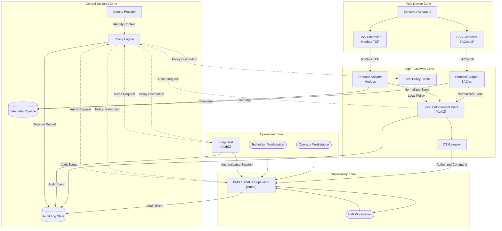

# Diagram Specification: OT Trust Boundary Overview

**Proposed file names:**
- Mermaid source: `ot-trust-boundary-overview.mmd`
- Draw.io source: `ot-trust-boundary-overview.drawio`
- Exported image: `ot-trust-boundary-overview.png`

---

## 1. Proposed Diagram Title

**OT Identity-Aware Authorization: Trust Zones and Decision Points**

A subtitle line may optionally read:

*Showing operational zones, protocol boundaries, authorization enforcement points, and audit event flow*

---

## 2. Textual Layout Description

The diagram is organized as a vertical stack of horizontal zones, reading from bottom to top in order of increasing abstraction — field devices at the bottom, central services at the top. This orientation mirrors common OT reference architectures (e.g., the Purdue Model) and gives readers an intuitive spatial reference.

### Zone stack, bottom to top:

**Zone 1 — Field Device Zone** *(bottom)*
The lowest layer. Contains BAS controllers and connected sensors or actuators communicating over field-level protocols (BACnet, Modbus, proprietary variants). These devices have no native identity or authentication capability in most deployments. They represent the operational core that all upper layers exist to protect and support.

**Zone 2 — Edge / Gateway Zone**
The protocol translation and first enforcement boundary. Contains the OT gateway, protocol adapters, a local policy enforcement point, and a local policy cache. This zone is where field-protocol messages are normalized, where identities are attached to requests, and where authorization decisions are applied as close to the field as possible. The local policy cache enables resilient offline authorization when connectivity to central services is interrupted.

**Zone 3 — Supervisory Zone**
The operational supervisory layer. Contains BMS/SCADA supervisor systems and HMI workstations. This zone issues commands to the edge layer and receives aggregated status data. Operators interacting with the system through this layer are authenticated before commands propagate downward.

**Zone 4 — Operations Zone** *(upper operational layer)*
The human-facing access layer. Contains operator workstations, technician workstations, and a jump host for remote access. This is where human principals authenticate and initiate interactions. The jump host is the ingress point for remote or vendor access. All sessions originating here carry authenticated identity that must propagate to downstream layers.

**Zone 5 — Central Services Zone** *(top)*
The identity and policy infrastructure layer. Contains the identity provider, policy engine, audit log store, and telemetry pipeline. This zone services requests from all enforcement points below it. It is the authoritative source of policy and the central sink for audit events. It is architecturally distinct from the operational zones and communicates with the edge and supervisory layers primarily over control-plane channels.

### Horizontal flows between zones:

- **Control plane flows** run vertically between Central Services and the enforcement points at the Edge and Supervisory layers (policy distribution downward, policy evaluation requests upward).
- **Data plane flows** run vertically from Field Devices upward through protocol adapters into the telemetry pipeline.
- **Operator command flows** run downward from Operations through Supervisory and Edge to Field Devices, crossing each trust boundary at a defined enforcement point.
- **Audit event flows** run laterally or upward from all enforcement points to the Audit Log Store in Central Services.

---

## 3. Major Components

### Field Device Zone
| Component | Description |
|---|---|
| `BAS Controller (BACnet)` | A representative field controller communicating over BACnet/IP or BACnet MS/TP. Shown as a single instance with implicit multiplicity. |
| `BAS Controller (Modbus)` | A representative field controller communicating over Modbus TCP or RTU. Distinct from the BACnet controller to illustrate protocol heterogeneity. |
| `Sensors / Actuators` | Downstream field devices connected to controllers. Shown aggregated; not individually enumerated. |

### Edge / Gateway Zone
| Component | Description |
|---|---|
| `OT Gateway` | Mediates communication between the field device zone and the supervisory zone. Acts as the primary trust boundary enforcement point for field-to-supervisory traffic. |
| `Protocol Adapter (BACnet)` | Normalizes BACnet messages into the internal representation used by the authorization and telemetry infrastructure. |
| `Protocol Adapter (Modbus)` | Normalizes Modbus messages. Shown separately to indicate that adapters are protocol-specific. |
| `Local Enforcement Point` | Applies authorization decisions to traffic crossing the edge zone boundary. Consults the local policy cache when the policy engine is unreachable. |
| `Local Policy Cache` | Holds a time-bounded copy of relevant policy, used for resilient offline operation. Populated by the policy engine via control-plane synchronization. |

### Supervisory Zone
| Component | Description |
|---|---|
| `BMS / SCADA Supervisor` | The supervisory control system. Issues commands to the edge layer and aggregates status. Authenticated operators interact through this layer. |
| `HMI Workstation` | The human-machine interface at the supervisory level. Operator actions here produce commands that are authorized before reaching field devices. |

### Operations Zone
| Component | Description |
|---|---|
| `Operator Workstation` | A workstation used by facility operators for routine monitoring and control. Authenticated identity is established here. |
| `Technician Workstation` | A workstation used by maintenance technicians for configuration and diagnostic work. May carry elevated temporary permissions during maintenance windows. |
| `Jump Host` | The ingress point for remote operator and vendor access. Authentication is enforced here; sessions carry identity context into the downstream zones. |

### Central Services Zone
| Component | Description |
|---|---|
| `Identity Provider (IdP)` | Issues and validates identity credentials for operators, devices, and services. The authoritative source of authenticated identity. |
| `Policy Engine` | Evaluates authorization requests from enforcement points. Receives subject identity, resource descriptor, and requested action; returns an authorization decision. |
| `Audit Log Store` | Receives and persists structured authorization decision records and security-relevant events from all enforcement points. Append-only. |
| `Telemetry Pipeline` | Receives normalized telemetry from protocol adapters; routes to monitoring, analytics, and storage systems. Separate from the audit pipeline. |

---

## 4. Trust Boundaries

Trust boundaries are rendered as **dashed enclosing borders** with a short label. The following boundaries must be explicitly represented:

### TB-1: Field Device Zone Boundary
Separates field controllers and their connected devices from the edge/gateway zone. Enforcement occurs at the OT Gateway and protocol adapters. Traffic crossing this boundary is normalized and has identity context attached.

**Label:** `Field Device Zone`
**Enforcement point at crossing:** OT Gateway / Protocol Adapters

### TB-2: Edge Zone Boundary
Separates the gateway and adapter layer from the supervisory zone. The Local Enforcement Point applies authorization decisions here. Crossing requires an `allow` decision from the policy engine (or local cache).

**Label:** `Edge / Gateway Zone`
**Enforcement point at crossing:** Local Enforcement Point

### TB-3: Supervisory Zone Boundary
Separates the supervisory layer from the operations zone. Operator commands originating from workstations or the jump host cross this boundary carrying authenticated identity.

**Label:** `Supervisory Zone`
**Enforcement point at crossing:** BMS / SCADA Supervisor (enforces before sending downward)

### TB-4: Operations Zone Boundary
Separates human-facing access infrastructure from the supervisory layer. The jump host enforces authentication at the ingress point for remote sessions.

**Label:** `Operations Zone`
**Enforcement point at crossing:** Jump Host (remote access), workstation authentication

### TB-5: Central Services Zone Boundary
Separates the identity and policy infrastructure from all operational zones. Control-plane traffic crosses this boundary. Central Services are not in the operational data path; they are consulted by enforcement points.

**Label:** `Central Services Zone`
**Note:** Emphasize that this zone is control-plane only — it does not carry operational workloads.

---

## 5. Recommended Diagram Style

- **Layout:** Top-to-bottom flowchart with zone subgraphs arranged vertically. Field devices at the bottom; Central Services at the top.
- **Component shapes:**
  - Rectangular boxes for all system components (no icons, no 3D shapes)
  - Cylinders for the Audit Log Store and Telemetry Pipeline (conventional data store notation)
  - A distinct box style (rounded rectangle) for human actors (Operator, Technician) to distinguish principals from systems
- **Trust boundaries:** Dashed enclosing borders with labels at the top-left of each zone. Solid borders or no borders for internal groupings within a zone.
- **Arrow styles:**
  - Solid arrows for data plane flows (commands, telemetry, messages)
  - Dashed arrows for control plane flows (policy distribution, policy evaluation requests)
  - Dotted arrows for audit event flows
- **Arrow labels:** Short, specific. Use protocol names on data plane arrows (e.g., `BACnet/IP`, `Modbus TCP`). Use descriptive phrases on control plane arrows (e.g., `Authorization Request`, `Policy Update`, `Audit Event`).
- **Authorization decision markers:** Mark each enforcement point with a small inline label or badge: `[AuthZ]`. This makes the sites of authorization decisions unambiguous.

---

## 6. Recommended Color Usage

Follow the color semantics defined in `docs/diagrams/README.md`. Applied to this diagram:

| Zone / Component type | Fill color | Rationale |
|---|---|---|
| Field Device Zone background | Very light blue-gray (`#EEF2F7`) | OT / device layer |
| BAS Controllers, Sensors | Light blue-gray (`#D6E4F0`) | OT components |
| Edge Zone background | Light warm gray (`#F5F5F5`) | Neutral gateway layer |
| OT Gateway, Protocol Adapters | Light blue-gray (`#D6E4F0`) | Still OT components |
| Local Enforcement Point | Light yellow (`#FFF9C4`) | Enforcement / gateway function |
| Local Policy Cache | Light yellow (`#FFF9C4`) | Authorization-adjacent |
| Supervisory Zone background | Very light gray (`#FAFAFA`) | Operational but higher layer |
| BMS / SCADA, HMI | White with gray border | Neutral operational system |
| Operations Zone background | White | Human-facing layer; minimal color |
| Operator / Technician | White, rounded rectangle | Human principal |
| Jump Host | Light yellow (`#FFF9C4`) | Enforcement point |
| Central Services Zone background | Very light orange (`#FFF3E0`) | Identity / authorization layer |
| Identity Provider | Light orange (`#FFE0B2`) | Identity component |
| Policy Engine | Light orange (`#FFE0B2`) | Authorization component |
| Audit Log Store | Light green (`#E8F5E9`) | Audit / telemetry infrastructure |
| Telemetry Pipeline | Light green (`#E8F5E9`) | Audit / telemetry infrastructure |

**Ensure all diagrams remain legible in grayscale.** Trust boundaries (dashed borders) and component type (shape) must distinguish zones without relying on color alone.

---

## 7. Mermaid Diagram Starter Code

The following Mermaid code provides a working structural starting point. It uses `flowchart TB` with subgraphs for zones. Labels on arrows indicate flow types. This version prioritizes structural accuracy and is suitable for embedding in Markdown documentation.

### Notes on the Mermaid code

- `[AuthZ]` inline labels on enforcement point nodes mark where authorization decisions occur. These can be styled distinctly in rendered output.
- Solid arrows represent data plane flows. Dashed arrows (`-.->`) represent control plane flows (policy distribution, authorization requests).
- The `direction LR` within subgraphs encourages horizontal component layout within each zone, while the overall `TB` layout preserves the vertical zone stack.
- Mermaid does not natively support dashed-border subgraphs for trust boundaries. In the rendered version, zone labels serve as the trust boundary indicator. For explicit dashed-border trust zones, the Draw.io version is recommended.
- The `[(" ")]` shape notation renders as a cylinder (data store) for `AUDIT` and `TELEM`.
- The `([" "])` shape notation renders as a rounded rectangle (stadium shape) for human principals.

---

## 8. Suggestions for the Draw.io Version

The Mermaid version above is suitable for Markdown documentation and quick reference. For the white paper version intended for PDF inclusion, a Draw.io diagram will provide the necessary visual control. The following guidance applies to building that version.

### Layout

Use a strict top-to-bottom zone layout with explicit visual separation between zones. Increase vertical spacing between zones to give the dashed trust boundary borders room to breathe. Align components within each zone on a horizontal grid.

### Trust boundary borders

Draw each trust boundary as a dashed rectangle enclosing its zone. Use a consistent dash pattern (e.g., 6px dash, 3px gap) and a medium-weight stroke (1.5–2px). Apply the zone background fill color inside the boundary rectangle at low opacity (10–15%) so the fill tints the zone without obscuring component labels.

### Arrow routing

Use orthogonal routing for all arrows. Avoid diagonal lines. Group related arrows (e.g., all audit event flows) into a single color-coded set so their collective destination is visually apparent without tracking each arrow individually. Use arrow thickness to distinguish data plane (slightly heavier) from control plane (lighter, dashed).

### Control plane lane

Consider adding a narrow vertical lane on the right side of the diagram dedicated to control-plane flows between the Policy Engine and the enforcement points. This visually separates control-plane communication from the primary data flow, reinforcing the separation-of-planes principle. Label the lane header `Control Plane`.

### Enforcement point callouts

At each `[AuthZ]` enforcement point, add a small diamond or badge icon in the component's corner. Keep the badge minimal — a small border shape with the letter `A` or the text `AuthZ` in 8pt is sufficient. The goal is to make enforcement points scannable without adding visual clutter.

### Fonts and text

Use a single sans-serif font throughout (Inter, Helvetica, or Arial). Set component labels at 11pt and zone labels at 10pt italic. Arrow labels at 9pt. The diagram should be legible at the width of a single column in an A4 or letter-sized PDF.

### Export settings

Export at 2x resolution (approximately 2400px wide for a full-page diagram) as PNG for PDF inclusion. Also export SVG for any digital distribution format that supports vector rendering. Commit both the `.drawio` source and the exported files.

### File name for the polished version

`ot-trust-boundary-overview.drawio`

---

## Diagram Checklist

Before committing the final diagram:

- [ ] All components are labeled
- [ ] All arrows carry descriptive labels
- [ ] All trust boundaries are visually marked with dashed borders and zone labels
- [ ] All enforcement points are marked with `[AuthZ]` or equivalent
- [ ] Control plane and data plane flows are visually distinguishable
- [ ] Audit event flows are traceable to the Audit Log Store
- [ ] The Local Policy Cache relationship to offline resilience is apparent
- [ ] Diagram is legible in grayscale
- [ ] Font sizes are legible at intended render size
- [ ] `.drawio` or `.mmd` source file is committed alongside any exported image
- [ ] Alt-text is written for any Markdown image reference
