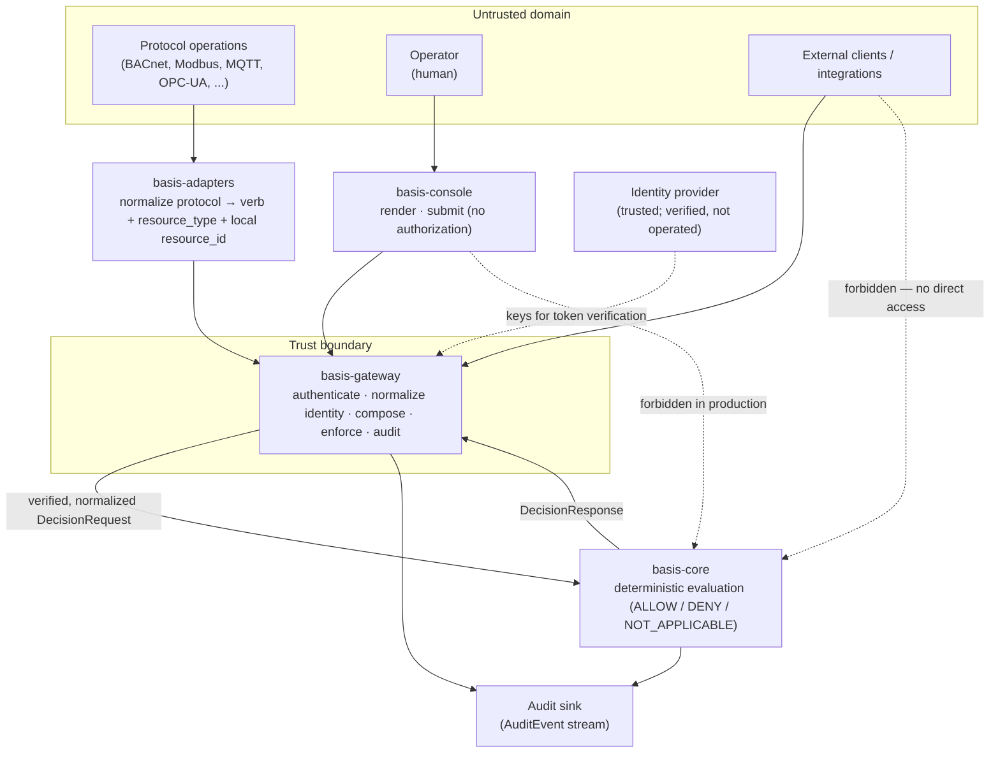

# BASIS Ecosystem Threat Model

This document is the threat model for the BASIS ecosystem. It describes what BASIS protects, what it trusts, what it does not trust, where its trust boundaries lie, how threats move through the system, and why the architecture is structured the way it is. It is an architecture document, not a deployment checklist or a compliance artifact.

The threat model exists to make the security reasoning behind the architecture legible. The component documents — the ecosystem overview in [`basis-ecosystem.md`](../architecture/basis-ecosystem.md) and the [`kernel-boundary-rules.md`](../kernel-boundary-rules.md), together with [`basis-gateway.md`](../architecture/basis-gateway.md), [`basis-adapters.md`](../architecture/basis-adapters.md), and [`basis-console.md`](../architecture/basis-console.md) — describe what each component does and why its boundaries are drawn where they are. This document reads those same boundaries through an adversarial lens: it asks what an attacker would have to do, which boundary they would have to cross, what crossing that boundary would cost the system, and what the architecture does to make the crossing harder or its consequences smaller.

The intended audience is security architects evaluating BASIS, OT and BAS engineers integrating it, contributors changing it, future maintainers reasoning about whether a proposed change weakens a boundary, and external reviewers assessing the security model. It assumes familiarity with the BASIS component vocabulary. Terms used here are defined in [`docs/glossary.md`](../glossary.md).

This document does not redefine component responsibilities. The recent reconciliation work — action vocabulary, action composition, and resource-identifier composition — established a single division of labor that this threat model treats as settled and reinforces rather than restates:

```text
Adapters normalize.
Gateway composes and enforces.
Core evaluates.
Console operates.
```

The reason that division matters for security is the subject of this document.

---

## Executive Summary

BASIS protects authorization decisions, policy integrity, identity context, audit evidence, enforcement integrity, the operational resources it governs, and the configuration that places its boundaries. It does so by arranging three properties in order — a request carries a verified **identity**, that identity is evaluated for **authorization** against policy, and the decision is recorded for **auditability** — and by assigning each property to a component that cannot substitute for another.

The architecture's security rests on a single division of labor: adapters normalize protocol traffic, the gateway authenticates, composes, and enforces, the kernel evaluates, and the console operates. The most isolated component, the kernel, is also the one that produces decisions; every other component exists to deliver verified, normalized input to it and to carry out and record its decisions. The gateway is the trust boundary — in a typical deployment it is the only network-facing component, and the kernel is not reachable directly at all.

The strongest security properties that follow from this structure are boundary ownership (each responsibility decided in exactly one place), fail-closed behavior (every ambiguous or error condition denies), kernel isolation (the decision engine has almost no attack surface), deterministic evaluation, and audit generation independent of enforcement. Together these mean a compromise of any one component is bounded by what the others still guarantee.

The model is candid about its limits. Several of its strongest guarantees — kernel isolation, the singular gateway boundary, configuration and secret integrity — are properties the architecture *requires of* a deployment rather than ones it *provides*, and will become verifiable only when the deploy layer is built. The trust base it depends on (the identity provider, policy authors, the deployment, the adapters) is stated explicitly in §9, and the risks it deliberately does not address are bounded in §10. Authorization is one layer of a broader security strategy, not a complete solution.

At the highest level, the system and its primary trust boundary look like this:



The dashed lines into the kernel are architectural invariants, not configuration options: untrusted callers and the console do not reach `basis-core` directly. Everything that crosses into the kernel has first been authenticated, validated, and normalized at the gateway. The sections that follow develop why each of these boundaries reduces risk and what happens when one is crossed.

---

## How to read this document

The threat model is organized as a sequence of analyses, not a vulnerability-and-fix list. Each threat is examined through a consistent frame:

```text
Threat
    → Trust Boundary
    → Architectural Consequence
    → Mitigation
```

This frame is deliberate. A threat is interesting here only insofar as it bears on a trust boundary; the architectural consequence is what happens to the system's guarantees when that boundary is crossed; and the mitigation is the architectural property that prevents the crossing, contains its blast radius, or makes it evident after the fact. Where a threat has no architectural mitigation — only an organizational, physical, or network control outside BASIS — this document says so plainly and records it as residual or out-of-scope rather than implying the architecture closes a gap it does not.

The document is structured to be read top to bottom the first time and consulted by section thereafter. Sections 1 through 5 establish the system, its assets, its boundaries, its actors, and its entry points. Sections 6 and 7 work through threats by component and through concrete abuse cases. Sections 8 through 11 map mitigations to architecture, state assumptions explicitly, bound the scope, and record what remains unresolved.

---

## 1. System Overview

### 1.1 What BASIS is

BASIS is an identity-aware authorization architecture for operational technology environments. Its purpose is to make authorization decisions — whether a given subject may perform a given action on a given resource — explicit, consistent, deterministic, and auditable across the heterogeneous protocols and long-lived equipment that characterize building automation and industrial control systems.

The security model of BASIS rests on three properties, applied in order:

```text
Identity
    ↓
Authorization
    ↓
Auditability
```

A request carries a verified **identity**. That identity is evaluated for **authorization** against policy. The decision and its context are recorded for **auditability**. Each property depends on the one above it: authorization without verified identity authorizes no one in particular, and auditability without an authorization decision records activity without recording whether it was permitted. The architecture is arranged so that these three properties are produced at defined points by defined components, and so that no component can substitute its own judgment for another's.

### 1.2 Ecosystem structure

The BASIS Core Services Distribution is a set of open-source components with a strict, downward-only dependency direction. The relevant components for this threat model are the authorization kernel (`basis-core`), the runtime and trust-boundary service (`basis-gateway`), the protocol normalization layer (`basis-adapters`), the operator interface (`basis-console`), the shared contracts (`basis-schemas`), and the deployment tooling (`basis-deploy`). The full ecosystem structure, including the Basis Foundation and the future commercial layer, is described in [`basis-ecosystem.md`](../architecture/basis-ecosystem.md); the kernel's isolation rules are in [`kernel-boundary-rules.md`](../kernel-boundary-rules.md).

### 1.3 The authorization request path

The architecture is organized around a single canonical path that an authorization request travels. Each component on the path owns exactly one responsibility, and the security properties of the system follow from that separation.

```text
Protocol Operations          (BACnet, Modbus, MQTT, OPC-UA, ... — untrusted field traffic)
        ↓
basis-adapters               normalize: parse protocol, emit verb + resource_type + local resource_id
        ↓
basis-gateway                authenticate, normalize identity, compose action and resource_id, enforce
        ↓
basis-core                   evaluate: deterministic policy decision (ALLOW / DENY / NOT_APPLICABLE)
        ↓
Authorization Decision       enforced at the gateway; serialized to protocol by the adapter; recorded in audit
```

The role of each component on this path:

**basis-adapters** is the only place protocol-specific code exists. An adapter parses a protocol-native operation — a BACnet `WriteProperty`, a Modbus function code, an MQTT publish — and normalizes it into a bare verb, a `resource_type`, and a local `resource_id`. It does not authorize. It does not authenticate users. It does not compose kernel-canonical identifiers. It carries the kernel's decision back to the protocol layer faithfully, expressing a `DENY` as a protocol-appropriate denial.

**basis-gateway** is the trust boundary. It authenticates the caller, verifies and normalizes identity into a `Subject`, composes the canonical action (`read` + `hvac` → `read:hvac`) and the canonical resource identifier (`ahu` + `rooftop-1` → `ahu:rooftop-1`) from the normalization inputs, invokes the kernel, enforces the returned decision, and emits audit evidence. It does not evaluate policy and it does not reinterpret the kernel's decision.

**basis-core** is the authorization kernel. It evaluates a `DecisionRequest` — a normalized subject, action, and resource identifier — against policy and returns a deterministic `DecisionResponse`. It has no network surface, no authentication layer, no protocol knowledge, and no transport. It assumes its inputs have already been verified and normalized.

**basis-console** is the operator interface. It renders policy state, decisions, and audit records, and submits operator requests — through the gateway, under the gateway's authentication and enforcement. It does not evaluate, authenticate, normalize protocols, or produce audit records of its own.

This is an authorization-centric architecture: the kernel that produces decisions is the smallest, most isolated, most heavily constrained component in the system, and every other component exists to deliver verified, normalized input to it and to faithfully carry out and record its decisions. The security argument of this document is, in large part, an argument that this arrangement is the correct one.

---

## 2. Assets Protected

BASIS exists to protect a specific set of assets. Naming them precisely matters: a threat is only meaningful in relation to an asset it would compromise, and a mitigation is only meaningful in relation to an asset it preserves. The assets below are listed roughly in order of how directly the architecture is responsible for them.

### 2.1 Authorization decision integrity

**What it is.** The correctness of each `DecisionResponse`: that an `ALLOW` is returned only when policy permits the request, that a `DENY` is returned when policy denies or does not cover it, and that the decision is a faithful function of the subject, action, resource, and policy set.

**Why it matters.** The decision is the product the entire system exists to produce. Every downstream effect — a command reaching a controller, an operator accessing audit records, a setpoint changing — is gated by it.

**Consequence of compromise.** If decision integrity is lost, the authorization layer is worse than absent: it grants a false assurance that access is governed while permitting access that is not. Unauthorized commands reach field devices under the appearance of having been authorized.

### 2.2 Policy integrity

**What it is.** The correctness and authenticity of the policy set the kernel evaluates — that the active rules are the rules an authorized policy author intended, unaltered in transit or at rest.

**Why it matters.** Deterministic evaluation against the wrong policy produces well-formed, confidently wrong decisions. The kernel cannot detect that its policy is incorrect; it can only evaluate faithfully against whatever it holds.

**Consequence of compromise.** Tampered policy turns every enforcement point that loads it into a reliable instrument of the attacker's intent. The blast radius is every decision the compromised policy reaches, and the effect is silent: the system continues to produce decisions that look authoritative.

### 2.3 Identity context

**What it is.** The verified `Subject` and `IdentityContext` that accompany a request — the assertion that the request originates from a specific, authenticated principal with specific verified roles.

**Why it matters.** Identity is the first of the three ordered properties; authorization and audit both rest on it. A decision is only as trustworthy as the identity it was evaluated against, and an audit record is only as attributable as the identity it captured.

**Consequence of compromise.** Forged or unverified identity context lets an attacker present themselves as an authorized principal. The kernel will evaluate the fabricated identity faithfully and the audit record will attribute the resulting actions to the impersonated subject, corrupting both the decision and its evidence in one step.

### 2.4 Audit evidence

**What it is.** The record of what was requested, by whom, against what, and what the system decided — the `AuditEvent` stream produced by the kernel and the gateway.

**Why it matters.** Authorization without auditability is insufficient: a system that makes correct decisions but cannot demonstrate what it decided cannot support investigation, accountability, or detection of the cases where its other protections failed. Audit is the architecture's record of its own behavior.

**Consequence of compromise.** Suppressed, altered, or fabricated audit evidence destroys the system's ability to reconstruct events. It can conceal an attack that succeeded, or manufacture evidence of activity that never occurred. Because audit is the detection layer for failures elsewhere, compromising it amplifies every other threat.

### 2.5 Enforcement integrity

**What it is.** The guarantee that the decision the kernel produced is the decision actually applied — that an `ALLOW` is acted on and a `DENY` actually blocks the operation at the enforcement boundary, whether that boundary is the gateway or, in the embedded model, the adapter host.

**Why it matters.** A correct decision that is not enforced is inert. Enforcement is the act of translating a decision into an operational effect; it is where authorization meets the physical system.

**Consequence of compromise.** If enforcement can be bypassed or inverted, the kernel's correctness becomes irrelevant. An attacker who can cause a `DENY` to be treated as a permit, or who can route traffic around the enforcement point entirely, has defeated the system regardless of how sound its evaluation is.

### 2.6 Operational resources

**What it is.** The OT and BAS resources the authorization layer governs — setpoints, control points, schedules, configuration parameters, the physical processes behind them.

**Why it matters.** These are the assets whose protection is the ultimate purpose of the system. Everything else BASIS protects is instrumental to protecting these.

**Consequence of compromise.** Unauthorized control of operational resources is the realization of the harm the architecture exists to prevent: unsafe equipment states, disrupted building operations, and physical consequences that no software layer can reverse after the fact.

### 2.7 Configuration integrity

**What it is.** The correctness of the configuration that determines how the components behave — the gateway's identity-provider configuration, adapter route and template configuration, deployment topology, and the placement of trust boundaries themselves.

**Why it matters.** Configuration determines where the trust boundary actually sits. A gateway misconfigured to trust the wrong issuer, or an adapter whose resource templates misrepresent the operation, undermines the architecture without altering any code.

**Consequence of compromise.** Configuration compromise relocates or dissolves trust boundaries silently. The components continue to function as designed; they simply enforce against the wrong assumptions. This is among the hardest classes of compromise to detect because nothing visibly fails.

---

## 3. Trust Boundaries

A trust boundary is a demarcation between two domains that operate under different assumptions about who is present and what they are permitted to do, where identity verification and authorization enforcement are applied to whatever crosses. As the white paper's trust-boundary analysis establishes, boundaries are architectural facts, not firewall locations or configuration artifacts. This section identifies the boundaries that matter for the BASIS components and, for each, names the trusted inputs, the untrusted inputs, the assumptions the boundary depends on, and what the boundary is expected to validate.

The single most important boundary in the architecture is the one around the kernel. Everything else in this section can be understood as protecting or feeding that boundary.

```text
        untrusted callers                         trusted, verified, normalized input
   (clients, adapters, console,   ──►  [ basis-gateway ]  ──────────────────────────►  [ basis-core ]
    protocol traffic, operators)         trust boundary                                   kernel
                                              │
                                              ▼
                                         audit evidence
```

### 3.1 User → Gateway

**The boundary.** Between any external caller and the gateway's API surface. This is the network-facing edge of the authorization system. In a typical deployment the gateway is the only component reachable from outside; the kernel is not on the network at all.

**Trusted inputs.** Nothing is trusted on arrival. A request becomes trusted only after the gateway verifies its credential and normalizes its identity. Until then, the request body, the claimed subject, the claimed roles, and the requested action and resource are all untrusted assertions.

**Untrusted inputs.** The bearer token (until its signature, expiry, and issuer are verified), the entire request payload, and any identity claim the caller makes about itself.

**Assumptions.** That the gateway is the only network path to the kernel; that the configured identity provider is trustworthy and its keys are authentic; that credentials presented were issued to the principal presenting them.

**Validation expectations.** Verify the credential (signature, expiry, issuer). Reject unauthenticated requests before evaluation. Validate the request against the `DecisionRequest` schema. Normalize verified claims into a `Subject` and `IdentityContext`. Fail closed on any failure. These are the gateway's pre-kernel responsibilities described in [`basis-gateway.md`](../architecture/basis-gateway.md); none of them is a semantic authorization decision, and all of them must complete before the kernel is invoked.

### 3.2 Gateway → Core

**The boundary.** Between the trust-boundary runtime and the kernel. This is an in-process or tightly controlled boundary, not a network one. It is the point at which a request, now carrying verified identity and a canonical action and resource identifier, enters the evaluation engine.

**Trusted inputs.** The `DecisionRequest` the gateway constructs — a normalized `Subject`, a composed canonical action, a composed canonical `resource_id`, and an `IdentityContext`. The kernel trusts these unconditionally: it assumes authentication and normalization already happened.

**Untrusted inputs.** From the kernel's perspective, none — but this is precisely why the boundary is load-bearing. The kernel has no defense against malformed or fabricated input. If an untrusted caller reaches this boundary directly, the kernel will evaluate fabricated identity and roles faithfully.

**Assumptions.** That only the gateway (and explicitly trusted in-process components) can reach the kernel; that the input has already been authenticated, validated, and normalized; that the kernel's evaluation is the authoritative decision and will be enforced upstream without reinterpretation.

**Validation expectations.** The kernel validates the structural form of its inputs — for example, that `resource_id` matches the canonical typed format — and defaults to deny for any action not covered by policy. It does not, and must not, attempt to authenticate the caller; that is not its job and it lacks the means.

### 3.3 Adapter → Gateway

**The boundary.** Between a protocol normalization component and the gateway, in the preferred gateway-mediated model. The adapter has just turned untrusted protocol traffic into a normalized authorization request.

**Trusted inputs.** After the adapter authenticates to the gateway, the gateway trusts the adapter to have parsed and normalized the protocol operation faithfully — to have preserved the operational intent of the request. This is the **trusted adapter boundary**: the adapter is trusted to normalize accurately, not to authorize.

**Untrusted inputs.** The protocol traffic the adapter received is untrusted — it may originate from unauthenticated field devices, controllers, or workstations. The adapter's job is to normalize it, not to extend protocol-layer trust to the authorization layer. The subject identity associated with a protocol operation is untrusted until the gateway verifies it.

**Assumptions.** That the adapter does not contain authorization logic; that the adapter does not override kernel decisions; that the adapter preserves protocol intent during normalization; that an adapter receiving untrusted protocol input does not treat the protocol channel as evidence of authorization.

**Validation expectations.** The gateway authenticates the adapter as a caller, composes the canonical action and resource identifier from the adapter's separate fields, and applies the same identity verification and enforcement it applies to any caller. The accuracy of the adapter's normalization is a precondition the gateway cannot verify at runtime — it is assured through adapter testing and version management, not runtime checks. This is a semantic trust boundary, and its properties are analyzed further in §6.3.

### 3.4 Operator → Console

**The boundary.** Between a human operator and the operator interface. The operator authenticates a session; the console mediates their interaction with the authorization system.

**Trusted inputs.** None established at the console itself. The console does not authenticate operators independently and does not authorize their actions. It participates in an authentication flow but defers verification to the gateway and the identity provider.

**Untrusted inputs.** Everything the operator submits through the console, until it has crossed the User → Gateway boundary and been authenticated and authorized there.

**Assumptions.** That the console never becomes an authorization or authentication authority; that all operator actions against the authorization system flow through the gateway; that the console does not reach the kernel directly in production; that operator-initiated operations are auditable because they pass through the gateway.

**Validation expectations.** The console forwards operator requests to the gateway and renders what the gateway returns. The gateway authenticates and enforces. A console action that produces no audit record through the gateway is an audit gap, not a console feature. The console's invariants — it renders and submits, it does not evaluate — are the boundary's protection, and are detailed in [`basis-console.md`](../architecture/basis-console.md).

### 3.5 Identity Provider → Gateway

**The boundary.** Between the external identity provider and the gateway. The gateway verifies credentials issued by the provider but does not operate it.

**Trusted inputs.** The provider's signing keys (obtained from its JWKS endpoint), and tokens whose signature, expiry, and issuer the gateway verifies against those keys. The provider is a **trusted** element of the architecture — see the assumptions in §9.

**Untrusted inputs.** Any token not yet verified; tokens from an unrecognized issuer; tokens whose signature does not validate against a known key.

**Assumptions.** That the identity provider is trustworthy and not itself compromised; that it issues credentials only to the principals they identify; that its key material is authentic and its rotation is observable to the gateway. BASIS verifies identity assertions; it does not establish identity. The trustworthiness of the provider is an assumption the architecture depends on and cannot internally guarantee.

**Validation expectations.** Verify token signature against the provider's published keys, check expiry, validate the issuer claim, and force a key refresh on an unknown key identifier. Crucially, the interpretation of the provider's claim conventions belongs at the gateway — the kernel must remain identity-provider-agnostic, so that changing providers requires no kernel change. This is why JWT and OIDC normalization is a gateway responsibility and not a kernel one.

### 3.6 Deployment boundary

**The boundary.** Between the deployed BASIS runtime and the environment that hosts it — the host operating system, the container runtime, the network segment, the secret store, and the deployment tooling that places the components and configures their trust relationships.

**Trusted inputs.** The configuration that tells the gateway which identity provider to trust, the policy the kernel loads, the placement that ensures only the gateway reaches the kernel, and the secrets (signing keys, tokens, certificates) the runtime depends on.

**Untrusted inputs.** Anything that can reach the components from outside the intended topology — a network path to the kernel that should not exist, a configuration source that should not be writable, a secret exposed where it should not be.

**Assumptions.** That the deployment environment is not already fully compromised at the point BASIS is installed; that the topology placing the kernel off the network is actually realized; that secrets are handled by the deployment, not by the kernel (which deliberately has no secret-handling capability). The deploy layer does not yet exist as a built component; this boundary is included because deployment determines whether every other boundary in this section is real or merely intended. See §6.5.

**Validation expectations.** Largely outside BASIS's runtime control today. The architecture's contribution is to make the requirements explicit: the kernel must be unreachable except through the gateway; configuration and policy must come from authorized sources; secrets must never enter the kernel. Verifying these is a deployment responsibility, analyzed as a future concern in §6.5 and bounded in §10.

### 3.7 Audit boundary

**The boundary.** Between the components that produce audit evidence (kernel and gateway) and the sink that persists it. Audit crosses from the authorization runtime into a record meant to outlive the request and resist the principals it describes.

**Trusted inputs.** The `AuditEvent` records the kernel and gateway emit, conforming to the canonical schema in `basis-schemas`.

**Untrusted inputs.** Any attempt to write, alter, or delete audit records from outside the defined emission path; any record that diverges from the canonical schema; any actor with operational privilege attempting to reach the audit store with those same privileges.

**Assumptions.** That audit is evidence, not enforcement — a decision is returned to the caller before and independently of audit write success, and an audit write failure does not reverse a decision. That the audit store's administrative control is, in a sound deployment, independent of the operational credentials whose actions it records. That audit completeness is contingent on connectivity and storage, not guaranteed.

**Validation expectations.** Emit audit on every evaluated request regardless of outcome. Preserve schema conformance and `schema_version`. Treat audit write failure as a monitored operational incident, not a silent gap. The architecture defines the contract; tamper-resistance and administrative independence of the store are deployment properties the architecture requires but cannot itself enforce. See §6.1, §6.2, and the abuse case in §7.4.

---

## 4. Actors and Adversaries

A threat model that assumes all threats are external is incomplete. BASIS is designed for environments where some of the most consequential threats originate from principals who are partially trusted — operators, integrators, the components themselves. This section names the legitimate actors the architecture serves and the adversaries it must withstand, including adversaries who begin inside the trust boundary.

### 4.1 Legitimate actors

**Operators.** Human principals who interact with the system through the console to inspect policy, review audit records, investigate denials, and submit changes. They authenticate as individuals and act within the authority their roles grant. Their access to the authorization system is itself subject to policy.

**Administrators.** Principals with elevated authority over configuration, policy authorship, and the deployment. Administrators define what the system enforces. Their authority is broad, which makes the integrity of their actions — and the auditability of those actions — particularly important.

**Automation systems.** Non-human principals such as a building management system that issues scheduled or reactive commands. They carry system identity rather than operator identity, and policy that governs their autonomous behavior is distinct from policy governing operator-initiated actions. Their actions must be attributed to the system principal, not to whichever operator last touched the system.

**Protocol integrations.** Adapters and the field-side systems they front. They are trusted to normalize faithfully and to carry decisions back to the protocol layer, and not trusted to authorize. They are legitimate actors in the normalization role and potential adversaries if compromised (see §4.2).

**External identity providers.** The systems that issue the credentials the gateway verifies. They are trusted to authenticate principals correctly. They are legitimate participants in the architecture and a trust assumption it depends on.

### 4.2 Adversaries

**External attacker.** A principal with no legitimate access who seeks to obtain it — by reaching the kernel directly, forging identity, exploiting an entry point, or bypassing enforcement. The architecture's network posture (kernel off the network, gateway as the sole controlled path) is aimed first at this adversary.

**Malicious insider.** A principal with legitimate access who abuses it — an operator exceeding their authority, an administrator acting against the system's purpose. The insider is partially trusted by definition, so the architecture's defense is not exclusion but constraint and attribution: policy bounds what each identity may do, and audit records what they did.

**Credential thief.** An actor who obtains a legitimate principal's credentials through theft, phishing, or session hijacking. To the architecture, a stolen-but-valid credential is indistinguishable from a legitimate one; the system enforces policy for the presented identity. This adversary sets a ceiling on what authorization alone can achieve and motivates the assumptions in §9 about identity-provider strength.

**Rogue integrator.** A party who supplies or configures an adapter and abuses that position — shaping normalization or resource templates so that operations are misrepresented to the kernel. Because the kernel cannot verify normalization at runtime, this adversary attacks the semantic trust boundary directly (see §6.3 and §7.3).

**Compromised adapter.** An adapter that has been subverted at runtime. It can misnormalize, inject false protocol context, or attempt to assert authorization it does not own. The architecture contains it by refusing to let adapters authorize and by composing canonical artifacts at the gateway rather than trusting adapter-supplied ones.

**Compromised gateway.** The most consequential component compromise, because the gateway is the trust boundary. A compromised gateway can fabricate identity, suppress audit, or misenforce. The architecture's structural answer is that even a compromised gateway cannot alter the kernel's evaluation semantics — but it can control what reaches the kernel and what is done with the result, which bounds how much the kernel's correctness can save. See §6.2 and §7.1.

**Compromised automation platform.** A subverted BMS or similar system that issues malicious commands under its system identity, or that forges operator identity on commands it forwards. The architecture's defense is that the platform is a subject like any other: its autonomous authority is bounded by policy, and identity propagation is expected to attribute forwarded commands to their true origin.

The recurring structure across these adversaries is that BASIS does not assume the boundary holds because the actor is internal. It assumes any actor — internal or external, human or component — may be the adversary, and it places its guarantees in the structure of the boundaries rather than in the good behavior of the principals crossing them.

---

## 5. Entry Points

An entry point is a place where data or control crosses into the system from a less-trusted domain. Each is an attack surface. This section enumerates the entry points the architecture exposes, why each exists, and what risk each introduces. The mitigations are developed in §6 through §8; here the goal is to make the surface explicit.

**API requests.** The gateway's HTTP surface (`/v1/evaluate` and operational endpoints) is the primary entry point and, by design, the only network-facing one in a typical deployment. It exists because the kernel is a library with no network surface; callers need a runtime boundary to reach. The risk it introduces is the risk of any network service: malformed requests, unauthenticated access attempts, and injection of fabricated identity or request content. It is also the point at which the most important architectural invariant is enforced — that untrusted callers reach the kernel only through here.

**Authentication flows.** The verification of bearer tokens (and optionally client certificates) against the configured identity provider. This entry point exists because identity must be established before authorization. Its risk is that a flaw in verification — accepting an unverified signature, an expired token, a wrong issuer, or a stale key — admits a forged or replayed identity, corrupting the first of the three ordered properties.

**Protocol inputs.** The protocol-native traffic adapters receive from the field — BACnet frames, Modbus PDUs, MQTT messages, and the rest. This entry point exists because the entire purpose of BASIS is to govern operational protocols. Its risk is twofold: malformed protocol input that could destabilize an adapter, and the more fundamental risk that protocol traffic carries no inherent identity, so the adapter must not mistake protocol-channel membership for authorization.

**Configuration inputs.** The configuration that tells each component how to behave — which identity provider the gateway trusts, how adapters map operations to resources, how the topology is laid out. This entry point exists because the components are deployment-agnostic and must be told their environment. Its risk is that configuration determines where trust boundaries actually sit; malicious or erroneous configuration relocates them without any code change and often without any visible failure.

**Policy files.** The policy the kernel loads and evaluates against. This entry point exists because policy is the externally authored definition of what is permitted. Its risk is direct: tampered or erroneous policy produces confidently wrong decisions across every enforcement point that loads it, and the kernel cannot detect that its policy is wrong.

**Console interactions.** Operator actions submitted through the console. This entry point exists because the system must be operable by humans. Its risk is operator error, misuse of legitimate authority, and any attempt to use the console as a path that bypasses the gateway's authentication and enforcement.

**Audit paths.** The path by which audit evidence is written to its sink, and any interface by which it is later read. This entry point exists because auditability is a first-class property. Its risk runs in both directions: an attacker who can write to the audit path can fabricate evidence, and one who can reach the store with operational privileges can suppress or alter it.

---

## 6. Threats by Component

This section works through threats component by component, in the order a request travels and a defender reasons: the kernel that must remain correct, the gateway that must remain the boundary, the adapters that must normalize faithfully, the console that must not overreach, and the deployment layer that must make all of it real. Each threat is framed as threat → trust boundary → architectural consequence → mitigation.

### 6.1 basis-core

The kernel is the asset most worth attacking and the component most constrained against attack. Its security posture is almost entirely a consequence of what it refuses to contain.

**Threat: decision integrity subverted by reaching the kernel with fabricated input.**

*Trust boundary:* Gateway → Core (§3.2). The kernel trusts its input absolutely.

*Architectural consequence:* If an attacker can submit a `DecisionRequest` directly — with a fabricated `Subject` and forged roles — the kernel evaluates it faithfully and returns an `ALLOW` the attacker engineered. Decision integrity (§2.1) and identity context (§2.3) are compromised together. The kernel has no authentication surface and cannot tell a forged subject from a real one; this is by design, not omission.

*Mitigation:* The kernel is not on the network. The Gateway → Core boundary is closed to untrusted callers by deployment, and the gateway is the sole controlled path. The kernel's lack of an authentication layer is what keeps it small and verifiable; the gateway's ownership of authentication is what makes that safe. Kernel isolation (§8) and the gateway's enforcement of the User → Gateway boundary together protect against this threat. The corresponding abuse case is §7.2.

**Threat: policy evaluation corrupted by tampered or incorrect policy.**

*Trust boundary:* The policy-file entry point (§5) and the deployment/control-plane path that delivers policy.

*Architectural consequence:* The kernel evaluates deterministically against whatever policy it holds. Tampered policy yields well-formed, wrong decisions at every enforcement point that loads it (§2.2). Because evaluation is deterministic, the wrongness is consistent and silent.

*Mitigation:* Determinism is itself a mitigation here, paradoxically: because the same inputs always produce the same decision, incorrect policy produces observable, reproducible patterns in audit rather than intermittent anomalies, and policy can be tested against known scenarios before deployment. The architecture places policy integrity protection at the control-plane and deployment boundaries (§3.6) rather than in the kernel, because the kernel cannot authenticate the source of its own policy. This bounds the threat to the integrity of the policy authorship and distribution path, which the architecture requires be protected with the same care as the kernel itself.

**Threat: audit generation suppressed or made to block decisions.**

*Trust boundary:* The audit boundary (§3.7).

*Architectural consequence:* If audit generation could be made a precondition of a decision, an attacker who disrupts the audit sink could deny service to the whole system; if audit can be silently suppressed, activity becomes invisible (§2.4).

*Mitigation:* The kernel's audit contract separates evidence from enforcement: a decision is returned before and independently of audit write success, and an audit write failure does not reverse a decision. This prevents audit from becoming a denial-of-service lever while requiring that audit gaps be surfaced as operational incidents rather than passing silently. The contract is the mitigation; the residual risk (a gap that is not monitored) is a deployment responsibility.

**Threat: extension interfaces abused to inject behavior into the kernel.**

*Trust boundary:* The kernel's extension points — the audit writer protocol, the policy rule contracts, the adapter contracts.

*Architectural consequence:* The kernel defines interfaces that higher layers implement. An implementation that misbehaves — an audit writer that drops records, a policy rule that is non-deterministic — could undermine the kernel's guarantees from within its own contracts.

*Mitigation:* The kernel constrains its extension points by contract: policy rules must be deterministic and stateless at evaluation time; the audit writer is invoked such that its failure cannot alter a decision; adapter contracts produce `DecisionRequest` objects and apply `DecisionResponse` outcomes but do not participate in evaluation. The kernel's import discipline and boundary rules (in [`kernel-boundary-rules.md`](../kernel-boundary-rules.md)) keep these interfaces narrow. Raw exceptions and internal state do not propagate to callers. The mitigation is that the extension surface is small, contractually bounded, and unable to reach evaluation semantics.

The throughline for the kernel: its security comes from subtraction. No network, no authentication, no protocol, no transport, no persistence, no I/O during evaluation. There is very little surface to attack because almost everything that could be attacked has been moved out of the kernel and given to components designed to defend it.

### 6.2 basis-gateway

The gateway is where the architecture concentrates the responsibilities the kernel refuses: authentication, identity normalization, composition, enforcement, and audit assembly. This concentration is deliberate — it puts the trust boundary in one auditable place — but it also makes the gateway the highest-value component to compromise.

**Threat: JWT/credential validation bypassed or weakened.**

*Trust boundary:* Identity Provider → Gateway (§3.5) and User → Gateway (§3.1).

*Architectural consequence:* If the gateway accepts a token whose signature does not verify, whose expiry has passed, or whose issuer is wrong, it admits a forged identity. Every property downstream rests on a false premise; the kernel will authorize the fabricated subject and the audit record will attribute the action to it (§2.3).

*Mitigation:* The gateway verifies signature, expiry, and issuer against the provider's published keys, refreshes keys on an unknown key identifier, and fails closed on any verification failure. Verification precedes evaluation; an unauthenticated request never reaches the kernel. The architectural property is that authentication is owned exclusively by the gateway and applied uniformly to every caller, so there is exactly one place this validation must be correct rather than many. The replay dimension is examined in §7.6.

**Threat: subject normalization manipulated to elevate roles.**

*Trust boundary:* Identity Provider → Gateway (§3.5).

*Architectural consequence:* Normalization translates verified provider claims into a `Subject` with roles the kernel evaluates. If an attacker can influence this translation — exploiting provider-specific claim handling — they can present a verified-but-elevated subject and obtain authorizations their real identity does not warrant (privilege escalation against §2.3).

*Mitigation:* Normalization happens only on claims that have already been cryptographically verified, and it is confined to the gateway so that the kernel never sees provider-specific claim structures. Keeping identity-provider knowledge out of the kernel (the `subject_from_jwt` boundary decision) means the translation logic lives in one component and can be reviewed as a unit. The architecture cannot prevent a provider from issuing a token with elevated claims — that is the provider's trust assumption (§9) — but it ensures the elevation must come from genuinely verified claims, not from normalization itself.

**Threat: request composition exploited to target an unintended resource or action.**

*Trust boundary:* Adapter → Gateway (§3.3) and the composition responsibility the gateway owns.

*Architectural consequence:* The gateway composes the canonical action (`read` + `hvac` → `read:hvac`) and canonical resource identifier (`ahu` + `rooftop-1` → `ahu:rooftop-1`) from normalization inputs. If composition is ambiguous or inconsistent — an already-typed identifier paired with a conflicting `resource_type`, or a type that contradicts a prefix — the kernel could evaluate a different question than the one the operation actually represents, producing a decision that is correct for the wrong target.

*Mitigation:* The reconciliation work makes the gateway the single composition boundary and gives it a dual-accept/reject discipline: it composes when inputs are unambiguous, passes through already-canonical input, and rejects ambiguous or contradictory combinations with a caller-safe error rather than guessing. Because the same `resource_type` feeds both the action's domain and the resource's type prefix at the same point, the composed action and composed resource are consistent by construction. Composition ownership at one boundary is itself the security property — it is examined as boundary ownership in §8. See [`resource-identifier-reconciliation.md`](../architecture/resource-identifier-reconciliation.md) and [`action-vocabulary.md`](../architecture/action-vocabulary.md).

**Threat: enforcement behavior subverted so a DENY is not applied.**

*Trust boundary:* The gateway's enforcement responsibility, downstream of Gateway → Core.

*Architectural consequence:* The kernel decides; the gateway enforces. If the gateway adds permit logic on top of the kernel's decision, selectively honors denials, or silently succeeds on a kernel error, then enforcement integrity (§2.5) is lost even though decision integrity held. A correct `DENY` that is not enforced is no protection.

*Mitigation:* A core invariant: the gateway must not reinterpret, supplement, or override the kernel's decision. A `DENY` is a `DENY`; a `NOT_APPLICABLE` is treated as `DENY` (fail-closed default); a kernel error fails closed. The gateway has only two legitimate pre-kernel rejection paths (unauthenticated, malformed), and neither is a permit. Fail-closed behavior (§8) is the mitigation, and the architecture treats any gateway that adds allow logic as non-compliant rather than as a configuration variant.

**Threat: audit evidence suppressed at the assembly point.**

*Trust boundary:* The audit boundary (§3.7).

*Architectural consequence:* The gateway assembles the canonical caller-facing audit record. A compromised gateway can selectively suppress its own audit, making its behavior partially invisible — and because connectivity gaps produce the same symptom (absent records for a window), suppression is hard to distinguish from routine delay without out-of-band verification (§2.4).

*Mitigation:* The gateway emits audit for every evaluated request regardless of outcome, and the kernel additionally writes its own decision record — two records from two components for the complete trail, so suppressing one still leaves the other where the deployment preserves both. The architecture requires that audit write failures be surfaced as monitored incidents. This threat is not fully closable by architecture alone: a gateway compromised below the audit layer can affect its own reporting, which is why the abuse case in §7.4 and the assumptions in §9 treat audit-store administrative independence as a deployment requirement.

The gateway's concentration of responsibility is a worthwhile trade because it makes the trust boundary singular and auditable, but the residual risk is correspondingly concentrated: the compromise of the gateway is the compromise of the boundary. The architecture's honest position is that it bounds this — the kernel's semantics remain intact, the kernel's own audit record remains independent — but it does not eliminate it.

### 6.3 basis-adapters

Adapters convert untrusted protocol traffic into normalized authorization requests. They occupy a semantic trust boundary: downstream components trust their normalization because no downstream component has the protocol knowledge to verify it.

**Threat: normalization altered so an operation is misrepresented to the kernel.**

*Trust boundary:* Adapter → Gateway (§3.3), specifically the semantic trust boundary.

*Architectural consequence:* If an adapter maps a write on a safety-critical control point to the descriptor of a non-critical point, the kernel evaluates the wrong question. An `ALLOW` under that misnormalization is meaningless as authorization evidence, and the resulting command reaches an operational resource (§2.6) it was never authorized to reach. Neither the gateway nor the kernel can detect the divergence at runtime.

*Mitigation:* The architecture's answer is honest about its limits. Normalization accuracy is assured through adapter testing against the device object model, version management, and change review — not runtime verification. The architectural protections are containment, not detection: the adapter cannot authorize, so a misnormalization still has to pass policy evaluation against the (wrong) resource it named; and protocol context the adapter carries is audit enrichment, not authorization input, so an adapter cannot smuggle authorization logic through the `context` field. The residual risk is real and is recorded as such; it is the price of having a protocol-agnostic kernel.

**Threat: protocol translation abused to inject adapter-level authorization logic.**

*Trust boundary:* Adapter → Gateway (§3.3) and the kernel boundary that forbids protocol logic in core.

*Architectural consequence:* An adapter that contained permit logic (`if role == admin: allow`) would become a parallel, ungoverned authorization system whose decisions bypass the kernel and the policy model entirely.

*Mitigation:* A design invariant: adapters normalize, they do not evaluate; adapters must not create parallel policy languages. Authorization decisions must originate from the kernel. The architecture treats an adapter containing authorization logic as non-compliant by definition — "an adapter that evaluates authorization logic is not an adapter; it is an enforcement boundary without the kernel's guarantees." The mitigation is structural: the only authorization authority in the system is the kernel, and the only path to it is the gateway.

**Threat: malformed protocol operations destabilize the adapter or pass through incorrectly.**

*Trust boundary:* The protocol-input entry point (§5).

*Architectural consequence:* Protocol traffic is untrusted and may be malformed or hostile. An adapter that mishandles it could crash (a denial of service at the field boundary) or, worse, normalize it into a valid-looking request.

*Mitigation:* Protocol parsing is confined entirely to the adapter — the terminal point of protocol-specific code — so the blast radius of malformed protocol input is bounded to the adapter and never reaches the kernel as protocol structure. Protected operations must fail closed: when authorization cannot complete, the adapter denies. The architecture localizes protocol risk where the protocol knowledge is, and requires fail-closed behavior so that a parsing or evaluation failure denies rather than permits.

**Threat: evidence integrity undermined by divergent adapter audit.**

*Trust boundary:* The audit boundary (§3.7).

*Architectural consequence:* If adapters emitted their own divergent audit records or new top-level fields, the canonical audit trail would fragment and its evidentiary value would erode (§2.4).

*Mitigation:* Adapters enrich audit through defined extension points (protocol type, operation name, device identifiers in the `context` field); they do not define independent audit semantics or diverge from the canonical `AuditEvent` schema, and they include `schema_version`. Audit assembly is owned by the gateway; the adapter contributes enrichment, not a parallel record. The mitigation is that audit remains a single governed schema with one assembly point.

A note on the embedded model: when an adapter invokes the kernel directly (air-gapped or resource-constrained deployments), it assumes the enforcement and audit responsibilities the gateway would otherwise carry. This does not change authorization semantics, but it relocates the trust boundary onto the adapter host, which must then protect that boundary as the gateway would. The threats in §6.2 apply to the adapter host in that topology. Deployment topology does not alter authorization semantics, but it does alter where the boundary — and therefore the risk — resides.

### 6.4 basis-console

The console is the lowest-privilege component in the authorization path by design: it renders and submits, and it owns no authorization, authentication, or protocol logic. Its threats are accordingly about overreach and misuse rather than about subverted evaluation.

**Threat: operator misuse of legitimate authority.**

*Trust boundary:* Operator → Console (§3.4), continuing to User → Gateway.

*Architectural consequence:* An operator acting within their granted authority but against the system's intent can cause harm the console cannot prevent — because the console is not where authority is decided.

*Mitigation:* The console does not authorize; the gateway enforces policy on every operator action, and the kernel evaluates it. Operator authority is bounded by policy, not by the console's interface, so misuse is constrained to what the operator's identity is actually permitted and is recorded in audit. The mitigation is that the console's lack of authority is structural: it cannot grant what policy denies.

**Threat: privilege escalation by bypassing the gateway.**

*Trust boundary:* Operator → Console (§3.4) and the forbidden Console → Core path.

*Architectural consequence:* A console that reached the kernel directly would bypass authentication, enforcement, and audit assembly — exactly the guarantees the gateway provides — and would present the kernel with input it was not designed to receive (§2.3, §2.5).

*Mitigation:* A console invariant: in production the console does not bypass gateway boundaries; direct console-to-kernel communication is permitted only in explicitly bounded local development tooling and must be documented as such. The console has no independent path to authorization state — it obtains everything through the gateway's authenticated APIs. The mitigation is the invariant plus the deployment property that the kernel is not reachable except through the gateway.

**Threat: visibility abuse — using read access to over-collect.**

*Trust boundary:* Operator → Console (§3.4).

*Architectural consequence:* The console surfaces policy state, decisions, and audit records. An operator with broad visibility could aggregate sensitive operational detail beyond their need.

*Mitigation:* Console access is itself subject to policy enforced at the gateway; visibility is not unconditional. The console renders what the gateway returns for an authenticated, authorized operator — so the scope of what an operator can see is a policy question the gateway answers, not a console default. The architecture's contribution is that observability flows through the same enforcement boundary as every other operation; the residual risk (an over-broad policy grant) is a policy-authorship concern.

**Threat: accidental disclosure through the interface.**

*Trust boundary:* Operator → Console (§3.4).

*Architectural consequence:* An interface can leak more than intended — exposing kernel internals, raw errors, or unsanitized denial reasons that reveal policy structure.

*Mitigation:* The architecture requires that raw errors and kernel internals not reach callers; the gateway returns sanitized denial reasons, and the console renders what it is given without manufacturing detail. The console must not alter the evidentiary meaning of audit data it displays. The mitigation is that the sanitization boundary is upstream of the console, so the console cannot disclose internals it never receives.

The console's design philosophy is that it improves operability without becoming an architectural boundary. Every time console scope would expand into evaluation, authentication, or protocol handling, the architecture treats that as overreach to be solved by improving a gateway API, not by adding logic to the console. This keeps the console outside the set of components whose compromise affects authorization correctness.

### 6.5 Future deploy layer

The deploy layer does not yet exist as a built component, but deployment is where every trust boundary in §3 becomes real or remains merely intended. A threat model that omitted it would imply the architecture's boundaries are self-enforcing; they are not. This section is included precisely because deployment security will eventually matter and because the architecture already depends on deployment properties it cannot itself guarantee.

**Threat: deployment integrity — components placed so the kernel is reachable directly.**

*Trust boundary:* The deployment boundary (§3.6) and, through it, Gateway → Core (§3.2).

*Architectural consequence:* The single most important invariant — that untrusted callers reach the kernel only through the gateway — is realized by deployment topology. A deployment that exposes the kernel on the network, or that admits a second path to it, dissolves the boundary while every component still appears to function (§2.1, §2.5).

*Mitigation:* The architecture states the requirement explicitly: in a typical deployment the kernel is not on the network at all, and the gateway is the sole controlled path. The deploy layer's eventual responsibility is to realize and verify that topology. Today the mitigation is the stated requirement and the kernel's deliberate lack of a network surface, which makes accidental exposure require positive misconfiguration rather than being a default.

**Threat: configuration drift relocating trust boundaries.**

*Trust boundary:* The deployment boundary (§3.6) and Identity Provider → Gateway (§3.5).

*Architectural consequence:* Configuration determines which identity provider the gateway trusts, what policy the kernel loads, and where the boundaries sit. Drift — an unreviewed change to issuer configuration, a policy path repointed, a topology altered — moves boundaries silently (§2.7). Nothing visibly fails.

*Mitigation:* The architecture's contribution is to make configuration a recognized entry point (§5) and a protected asset (§2.7), and to keep configuration out of the kernel so the kernel's behavior does not depend on environment-specific settings. The eventual deploy layer is the place to add configuration validation and change review. Today this is largely a deployment responsibility, recorded honestly as such and bounded in §10.

**Threat: secret handling — exposure of keys, tokens, or certificates.**

*Trust boundary:* The deployment boundary (§3.6).

*Architectural consequence:* The gateway depends on secrets (signing keys it trusts, credentials it presents). Exposed secrets enable forged identity (§2.3) or impersonation of trusted components.

*Mitigation:* A deliberate architectural choice contains this: the kernel has no secret-handling capability at all — no token issuance, no key management, no JWKS fetching — so secrets never enter the most isolated component and a kernel compromise yields no secrets. Secret handling is a gateway-and-deployment concern. The eventual deploy layer owns secret provisioning and rotation; the architecture's present contribution is to keep the secret surface out of the kernel and concentrated where it can be managed.

**Threat: topology assumptions that do not hold in the field.**

*Trust boundary:* The deployment boundary (§3.6).

*Architectural consequence:* The architecture assumes a topology — kernel isolated, gateway at the boundary, adapters at the field edge. A deployment whose real topology differs (a flat network, an adapter exposed to untrusted traffic without assuming enforcement responsibility) carries risk the architecture's reasoning did not account for.

*Mitigation:* The component documents make their topology assumptions explicit and require that deployment topology not alter authorization semantics. The embedded model is explicitly supported precisely so that constrained topologies have a defined, semantics-preserving option rather than an improvised one. The eventual deploy layer is where topology validation belongs. Until it exists, the mitigation is the explicitness of the assumptions and the requirement that constrained deployments shift enforcement responsibility deliberately rather than lose it.

The deploy layer is, in threat terms, the foundation the rest of the model stands on. The architecture is candid that several of its strongest properties — kernel isolation, the singular gateway boundary, configuration and secret integrity — are guarantees the architecture *requires of* the deployment rather than guarantees it *provides to* the deployment. Building the deploy layer is, in part, the work of turning those requirements into verifiable properties.

---

## 7. Abuse Cases

The component analysis in §6 reasons from the inside out. This section reasons from the attacker in: it walks concrete abuse cases end to end. Each gives the attacker's objective, the attack path, the architectural impact, and the mitigation, in the document's standard frame.

### 7.1 Gateway bypass — reaching the kernel directly

**Attacker objective.** Obtain an `ALLOW` for an operation policy would deny, by submitting a request directly to the kernel with a fabricated subject and roles.

**Attack path.** Locate a network path to `basis-core`, construct a `DecisionRequest` with an invented authorized subject, and submit it, skipping authentication, validation, and normalization at the gateway.

**Trust boundary.** Gateway → Core (§3.2). The kernel trusts its input unconditionally and has no authentication surface.

**Architectural impact.** Total compromise of decision integrity (§2.1) and identity context (§2.3) for any request the attacker can craft — the kernel would faithfully authorize fabricated identities.

**Mitigation.** The attack depends on a path that the architecture requires not to exist: in a typical deployment the kernel is not on the network, and the gateway is the sole controlled path. The dashed "forbidden — no direct access" line in the gateway and console architecture diagrams is an invariant, not a configuration option. The mitigation is kernel isolation realized by deployment topology (§3.6, §6.5, §8). Where this attack is possible at all, it is because a deployment violated the topology the architecture specifies.

### 7.2 Forged identity context — injecting identity claims

**Attacker objective.** Have the system treat a request as coming from an authorized principal the attacker is not.

**Attack path.** Present a fabricated or altered token to the gateway, or attempt to influence normalization so that verified claims map to elevated roles.

**Trust boundary.** Identity Provider → Gateway (§3.5) and User → Gateway (§3.1).

**Architectural impact.** If successful, every property downstream rests on a false identity (§2.3); the decision and the audit attribution are both corrupted.

**Mitigation.** The gateway verifies signature, expiry, and issuer against the provider's keys before any evaluation, and normalizes only already-verified claims. A fabricated token fails verification; an altered one fails signature. The architecture confines all of this to the gateway, so identity forgery must defeat cryptographic verification rather than exploit scattered, inconsistent checks. The residual path — a genuinely issued token with elevated claims — falls to the identity-provider trust assumption (§9), not to a gap in BASIS.

### 7.3 Policy tampering — altering policy behavior

**Attacker objective.** Change what the system permits, without touching any component's code, by altering the policy the kernel evaluates.

**Attack path.** Modify policy at rest, or inject altered policy through the distribution/deployment path, so the kernel loads rules the attacker shaped.

**Trust boundary.** The policy-file entry point (§5) and the deployment/control-plane path (§3.6).

**Architectural impact.** Confidently wrong decisions at every enforcement point that loads the tampered policy (§2.2), produced silently because evaluation remains deterministic.

**Mitigation.** The architecture places policy-integrity protection at the control-plane and deployment boundaries and requires that path be protected with the same care as the kernel. Determinism turns tampering into reproducible, auditable patterns rather than intermittent anomalies, and policy can be validated against known scenarios before deployment. The kernel cannot authenticate its own policy source — so the mitigation is boundary protection upstream plus the auditability that makes the effects visible after the fact. This is a threat the architecture bounds and surfaces rather than one it eliminates.

### 7.4 Audit suppression — hiding activity

**Attacker objective.** Perform actions without leaving a usable record, or erase records of actions already taken.

**Attack path.** Suppress audit at the assembly point (a compromised gateway), disrupt the audit sink, or reach the audit store with operational privileges and alter or delete records.

**Trust boundary.** The audit boundary (§3.7).

**Architectural impact.** Loss of the system's record of its own behavior (§2.4), which both conceals a successful attack and removes the detection layer for failures elsewhere.

**Mitigation.** Two records from two components (kernel decision record and gateway caller-facing record) mean suppressing one still leaves the other where the deployment preserves both. Audit is evidence, not enforcement, so suppression cannot be used to block decisions — but the architecture requires that audit write failures be surfaced as monitored incidents so a gap is not silent. The hard residual — a store reachable with the same privileges as the operations it records — is addressed by administrative independence of the audit store, a deployment property the architecture requires but cannot itself enforce (§9, §10).

### 7.5 Privilege escalation — gaining additional authority

**Attacker objective.** Act with more authority than the attacker's identity legitimately holds.

**Attack path.** Manipulate role normalization at the gateway, exploit ambiguous composition to target a resource under a more permissive policy, or use the console to reach a path that skips enforcement.

**Trust boundary.** Identity Provider → Gateway (§3.5), the gateway's composition responsibility (§3.3), and Operator → Console (§3.4).

**Architectural impact.** Authorization of operations beyond the attacker's legitimate authority (§2.3, §2.5).

**Mitigation.** Normalization operates only on verified claims and is confined to the gateway. Composition is single-owner with dual-accept/reject discipline, rejecting ambiguous or contradictory inputs rather than resolving them in the attacker's favor. The console cannot bypass the gateway in production and owns no authority of its own. Each escalation path is closed by a boundary-ownership property: authority is decided in exactly one place (the kernel, on input the gateway verified and composed), not in several places that could disagree (§8).

### 7.6 Replay — reusing previously valid requests

**Attacker objective.** Re-submit a previously valid, authorized request to cause its effect again without current authorization.

**Attack path.** Capture a valid authenticated request or token and replay it after the fact.

**Trust boundary.** User → Gateway (§3.1) and Identity Provider → Gateway (§3.5).

**Architectural impact.** An operation that was authorized once is effected again outside its intended window, potentially after the underlying authority has lapsed (§2.5).

**Mitigation.** The gateway's token verification includes expiry, which bounds the window in which a captured token is usable, and request correlation identifiers support detection of duplicates in audit. The architecture's honest position is that comprehensive replay protection (nonces, short-lived tokens, mutual-TLS-bound sessions) is partly a gateway-implementation and deployment concern rather than a fully settled architectural guarantee; the expiry bound and audit correlation are the architectural contributions, and tighter replay defenses are noted among the gateway's open questions. This case is recorded with its residual risk rather than as fully closed.

---

## 8. Mitigations

The preceding sections referenced a small set of architectural properties repeatedly. This section names them directly and explains why each reduces risk. These are architectural mitigations — properties of how the system is structured — not implementation techniques. Their power is that they hold across deployments and across the specific threats in §6 and §7 rather than addressing any one of them in isolation.

**Boundary ownership.** Each responsibility is owned by exactly one component at exactly one boundary: adapters normalize, the gateway composes and enforces, the kernel evaluates, the console operates. This is the deepest security property in the architecture, not merely an implementation tidiness. When a responsibility has a single owner, there is one place it must be correct and one place to audit it; when authority is decided in one place rather than several, components cannot disagree in ways an attacker exploits. The action and resource-identifier reconciliation work is the clearest expression of this: rather than letting adapters, the gateway, and the console each compose canonical artifacts (and drift apart), composition was assigned to one boundary — the gateway — so the action's domain and the resource's type are produced from the same input and are consistent by construction. Boundary ownership is what makes the other mitigations possible: fail-closed behavior, kernel isolation, and auditability each depend on responsibilities not being smeared across components.

**Fail-closed behavior.** In every ambiguous or error condition, the system denies. A `NOT_APPLICABLE` is treated as `DENY`; an unmatched action defaults to deny; a kernel error, a validation failure, an authentication failure, an unavailable kernel — all fail closed. This matters because an authorization system's failures should subtract access, not add it. An attacker who can induce a failure should gain nothing; the worst they achieve is denial of service, which is visible, rather than silent unauthorized access, which is not. Fail-closed is why inducing errors is not a productive attack strategy against BASIS, and it is why the gateway's prohibition on adding permit logic is an invariant rather than a preference.

**Gateway-owned authentication.** Authentication lives in exactly one component, applied uniformly to every caller. This concentrates the place credential verification must be correct, lets the kernel remain free of identity-provider knowledge, and means changing identity providers requires no change to the evaluation core. One correct authentication implementation is more defensible than many partial ones scattered across callers.

**Gateway-owned composition.** The canonical action and resource identifier are composed at one boundary, from the same inputs, with explicit rejection of ambiguity. This removes a class of attacks where a request is made to evaluate a different question than the operation actually represents, and it keeps adapters free of kernel-specific identifier rules so that protocol code does not encode authorization structure.

**Kernel isolation.** The kernel has no network, no authentication, no transport, no protocol knowledge, no persistence, and no I/O during evaluation. This is risk reduction by subtraction: the most security-critical component has almost no attack surface because almost everything attackable has been moved out of it and given to components designed to defend it. Isolation is also what makes the kernel small enough to test exhaustively and reason about confidently. The kernel boundary rules in [`kernel-boundary-rules.md`](../kernel-boundary-rules.md) are, read through this lens, a standing security control: they keep the attack surface from creeping back in.

**Protocol normalization boundaries.** All protocol-specific code is confined to adapters — the terminal point of protocol logic. Malformed or hostile protocol input has a bounded blast radius (the adapter) and never reaches the kernel as protocol structure. This localizes protocol risk where the protocol knowledge is and keeps the rest of the system protocol-agnostic.

**Deterministic evaluation.** The same subject, action, resource, and policy set always produce the same decision, with no dependence on mutable external state. Determinism is a security property: it makes incorrect policy produce reproducible, auditable patterns rather than intermittent anomalies; it makes evaluation testable against known scenarios before deployment; and it removes timing- and state-dependent decision behavior that an attacker could probe.

**Audit generation.** Every evaluated request produces evidence, from two components, independently of whether the audit write succeeds. Auditability is the architecture's record of its own behavior and the detection layer for the cases where other protections failed. Separating audit (evidence) from enforcement (the decision) prevents audit from becoming a denial-of-service lever while ensuring the system can be held to account for what it decided.

**Separation of responsibilities.** The composite of the above: identity, authorization, and auditability are produced in order by components that cannot substitute for one another. No component can authorize without the kernel, reach the kernel without the gateway, authenticate without the gateway, or evade audit without defeating two independent records. The separation is what turns a set of components into a defensible system: a compromise of any one component is bounded by what the others still guarantee.

These mitigations reinforce one another. Kernel isolation is safe only because the gateway owns authentication; fail-closed behavior is meaningful only because boundary ownership ensures there is no second path that fails open; auditability is trustworthy only because two components produce independent records. The architecture's security is the product of these properties together, not the sum of them separately.

---

## 9. Assumptions

A threat model is only as honest as its assumptions are explicit. The following are conditions BASIS depends on but does not, and in most cases cannot, guarantee internally. Where an assumption fails, the threats it bounds are no longer bounded; stating them plainly is what lets a deployment reason about its actual posture rather than an idealized one.

**Identity providers are trusted.** BASIS verifies identity assertions; it does not establish identity. The gateway trusts that the configured identity provider authenticates principals correctly and issues credentials only to the principals they identify. A compromised or misconfigured provider that issues a valid token with elevated claims defeats the architecture's identity guarantees, because the gateway will faithfully verify and normalize a genuinely-signed token. The strength of authentication (multi-factor for human principals, for instance) is a property of the provider, not of BASIS, and it sets a ceiling on what authorization can achieve.

**Deployment environments are not already fully compromised.** The architecture assumes that at the point BASIS is installed, the host operating systems, container runtime, and network are not already under adversary control. BASIS protects authorization decisions; it does not defend the substrate it runs on. An attacker with root on the gateway host, or control of the network segment between components, operates below the level the architecture governs.

**Policy authors are authorized.** The architecture assumes that those who author and approve policy are entitled to do so and act in good faith. Policy is the definition of what is permitted; a malicious or careless author with legitimate policy-authoring authority can grant access directly, and the kernel will enforce it faithfully. Access to policy authorship is itself a control the deployment must govern.

**Operators understand resource semantics.** The architecture assumes operators and administrators understand what the resources they govern actually are — that a given resource identifier corresponds to the operational system they believe it does. Much of the architecture's correctness rests on the resource identifier being a faithful name for a real operational target; an operator who misunderstands that mapping can author policy or approve actions that have effects they did not intend.

**Protocol integrations behave according to contract.** The architecture assumes adapters normalize faithfully, preserve protocol intent, do not authorize, and carry decisions back to the protocol layer correctly. Because no downstream component can verify normalization at runtime, the accuracy of an adapter is a precondition the architecture trusts and assures through testing and version management rather than runtime checks. A non-compliant or compromised adapter violates an assumption the gateway and kernel cannot independently detect.

**The audit store's administrative control is independent of operational credentials.** The architecture assumes that, in a sound deployment, the credentials required to alter or delete audit records are distinct from the operational credentials whose actions those records describe. Where this fails — where one role can both act and rewrite the record of acting — audit ceases to be trustworthy evidence. The architecture defines the audit contract; this independence is a deployment property it requires but cannot enforce.

**Deployment realizes the specified topology.** The architecture assumes the kernel is actually unreachable except through the gateway, that the gateway is actually at the boundary, and that secrets actually stay out of the kernel. These are requirements the architecture states; deployment makes them true. The eventual deploy layer is, in large part, the work of turning these assumptions into verified properties.

None of these assumptions is a weakness to be apologized for; every system has a trust base. The discipline the architecture imposes is to keep the trust base small, explicit, and located where it can be governed — the identity provider, the policy authors, the deployment, the adapters — rather than diffuse and hidden inside the evaluation core.

---

## 10. Out-of-Scope Risks

Authorization is one layer of a broader security strategy. BASIS improves accountability and access control within its layer; it does not replace physical security, network segmentation, endpoint and host hardening, or the identity controls operated by the identity provider. Those layers address risks the authorization architecture structurally cannot reach, and the protections in this document assume they are present and functioning. BASIS is designed to work alongside them, not in place of them.

Stating what BASIS does not solve is as important as stating what it does. A system that implied universal coverage would mislead the people relying on it. The following risks are real and consequential, and they are deliberately outside the authorization architecture's scope. The architecture's relationship to each is to clarify the boundary, not to claim the gap.

**Physical attacks.** Direct physical access to controllers, gateways, network infrastructure, or operator workstations is outside the authorization layer's reach. A technician at a controller's maintenance port, or an attacker with physical access to a gateway host, operates beneath the layer BASIS governs. Physical security controls address this; the software architecture cannot substitute for them.

**Device firmware compromise.** A field device compromised at the firmware level may behave maliciously while presenting valid protocol traffic. BASIS authorizes operations directed at devices; it does not attest device firmware integrity, and field devices in most deployments cannot self-attest. Hardware attestation and supply-chain controls address this below the layer the architecture operates at.

**Operating system compromise.** Compromise of the host OS underneath any BASIS component is outside scope. An attacker with control of the substrate can subvert the component running on it regardless of the component's design. This is the substrate assumption of §9 stated as an explicit non-goal.

**Network segmentation failures.** BASIS assumes, but does not implement, the network topology that places the kernel off the network and the gateway at the boundary. Failures of segmentation — a flat network, an unintended route to the kernel — are network-control failures. The architecture specifies the required topology and depends on the network to realize it.

**Vendor-specific protocol vulnerabilities.** Weaknesses in the field protocols themselves, or in specific vendor implementations of them, are outside the authorization layer. Adapters normalize protocol operations; they do not remediate protocol-level flaws. A protocol that permits spoofing at the wire level presents traffic the adapter will normalize as given.

**Supply-chain attacks outside BASIS components.** Compromise of dependencies, build pipelines, or third-party components outside the BASIS distribution is outside this model's scope. The architecture reasons about the trust boundaries among its own components and the deployment that hosts them; it does not extend to the provenance of everything in the surrounding environment.

These exclusions are not a retreat. They mark the line between what an authorization architecture can guarantee and what must be provided by the physical, network, personnel, and supply-chain controls around it. BASIS is one layer of a defense that depends on the others; it improves accountability and access control within its layer and does not claim to be a complete security solution. This position is consistent with the repository's security philosophy: the documentation emphasizes residual risk and deployment tradeoffs rather than presenting identity-aware authorization as sufficient on its own.

---

## 11. Open Security Questions

This section records questions the architecture has not yet resolved. They are recorded rather than forced: premature resolution would bake in decisions before the constraints that should shape them are understood. Each is a real uncertainty that future work — and in several cases the future `basis-schemas` and `basis-deploy` repositories — will need to settle.

**Audit persistence and tamper-resistance models.** The architecture defines the audit contract (evidence, not enforcement; canonical schema; emission on every request) but not a canonical persistence model. Whether the reference distribution should specify append-only semantics, cryptographic chaining, out-of-band replication, or a particular administrative-independence model is unresolved. The audit-store administrative-independence assumption (§9) is currently a deployment requirement; whether and how the architecture should provide more of it is open.

**Deployment hardening guidance.** The deploy layer does not yet exist (§6.5). The form its hardening guidance should take — how it verifies kernel isolation, validates configuration, manages secrets, and confirms topology — is unresolved. Much of §6.5 and several assumptions in §9 are written against a component that has yet to be designed.

**Multi-site trust relationships.** OT deployments are frequently multi-site, with policy distribution and consistency to manage across sites with differing connectivity. How trust relationships, policy consistency, and audit aggregation should work across sites — and what new boundaries multi-site operation introduces — is not addressed here and will need its own analysis.

**Delegated administration.** How administrative authority should be delegated, scoped, and bounded — particularly for large deployments and for the eventual commercial fleet-management layer — is open. Delegation introduces new trust relationships among administrators that this model does not yet analyze.

**Replay protection depth.** As §7.6 records, the architecture provides expiry bounds and audit correlation but has not settled comprehensive replay defense (nonces, short-lived tokens, session binding). This is partly a gateway-implementation open question and partly an architectural one about what guarantee the reference distribution should make.

**Schema governance and the action-domain / resource-type question.** The reconciliation work deferred a structural question to the future `basis-schemas`: whether an action's `{domain}` segment and a resource's `{type}` prefix are the same concept or two distinct ones. This has security relevance because it determines whether one field can safely drive both compositions or whether conflating them could let a request target an unintended resource category. It is recorded as an open question in [`resource-identifier-reconciliation.md`](../architecture/resource-identifier-reconciliation.md) and is not resolved here.

**Long-term key management expectations.** The gateway depends on key material from the identity provider and may present its own credentials. Long-term expectations for key rotation, revocation propagation, and key-management responsibility across the distribution and the eventual deploy and commercial layers are unresolved.

Recording these as open is itself a security posture. An architecture that claimed to have settled them prematurely would invite reliance on guarantees it had not actually thought through. The honest position is that these are known, they matter, and they will be resolved as the constraints that should govern them come into focus.

---

## Related Documents

- [`docs/architecture/basis-ecosystem.md`](../architecture/basis-ecosystem.md) — ecosystem structure, component responsibilities, dependency direction, and what belongs in the kernel
- [`docs/kernel-boundary-rules.md`](../kernel-boundary-rules.md) — the enforceable rules that protect `basis-core` as an isolated kernel; read here as a standing security control
- [`docs/architecture/basis-gateway.md`](../architecture/basis-gateway.md) — the trust-boundary runtime, its authentication and enforcement model, and its fail-closed semantics
- [`docs/architecture/basis-adapters.md`](../architecture/basis-adapters.md) — the normalization layer, the trusted adapter boundary, and the embedded vs. gateway-mediated models
- [`docs/architecture/basis-console.md`](../architecture/basis-console.md) — the operator interface and the invariants that keep it outside the authorization path
- [`docs/architecture/action-vocabulary.md`](../architecture/action-vocabulary.md) — action naming as a governed contract; the verb set and composition referenced in §6.2 and §8
- [`docs/architecture/resource-identifier-reconciliation.md`](../architecture/resource-identifier-reconciliation.md) — gateway-owned resource-identifier composition and the open action-domain/resource-type question
- [`docs/architecture/action-vocabulary-reconciliation.md`](../architecture/action-vocabulary-reconciliation.md) — the ecosystem inventory that established gateway-owned action composition
- [`docs/glossary.md`](../glossary.md) — definitions for Trust Boundary, Trusted Adapter Boundary, Authorization Kernel, Identity Propagation, Immutable Audit Logging, and related terms
- [`whitepapers/identity-aware-authorization-for-operational-technology/sections/05-ot-trust-boundaries.md`](../../whitepapers/identity-aware-authorization-for-operational-technology/sections/05-ot-trust-boundaries.md) — the OT trust-boundary and zone analysis this document builds on
- [`whitepapers/identity-aware-authorization-for-operational-technology/sections/08-threat-modeling-and-security-considerations.md`](../../whitepapers/identity-aware-authorization-for-operational-technology/sections/08-threat-modeling-and-security-considerations.md) — the white paper's OT-scoped threat analysis, complementary to this component-scoped model
- [`SECURITY.md`](../../SECURITY.md) — repository security policy and the philosophy of emphasizing residual risk over claims of sufficiency
